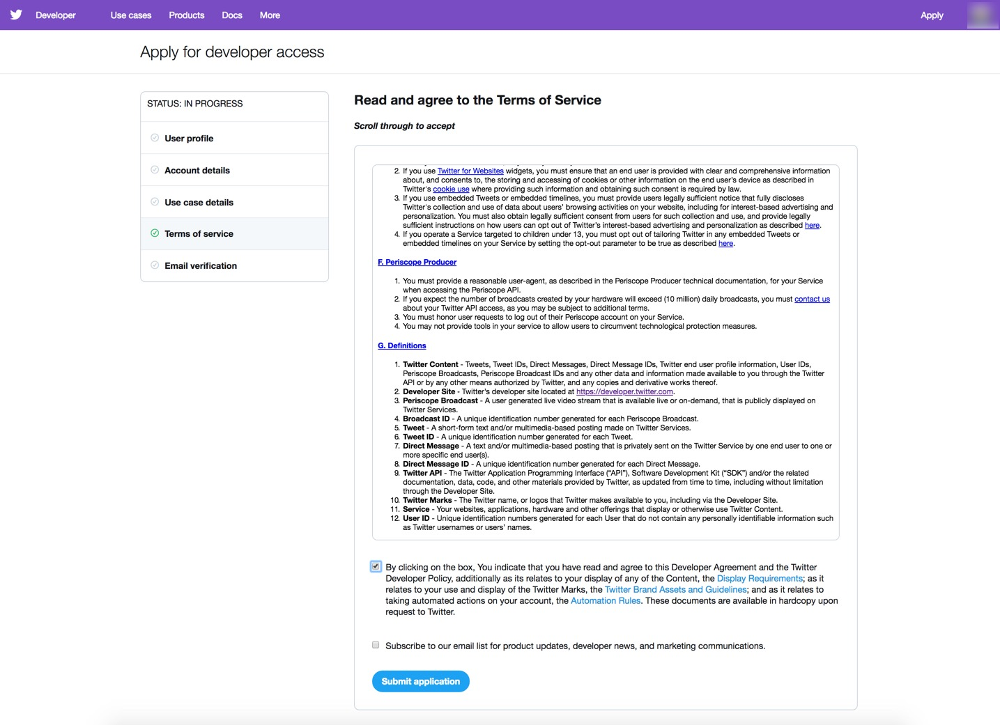

# Cài đặt môi trường

## Giới thiệu

Bây giờ chúng ta đã hiểu cơ bản về Phân tích Cảm xúc, hãy thiết lập môi trường phát triển để xây dựng ứng dụng Phân tích Cảm xúc. Đầu tiên, chúng ta sẽ cần tạo một Ứng dụng Twitter thông qua cổng thông tin Công cụ phát triển Twitter, điều này sẽ cho phép chúng ta nhận được các API KEYS và TOKENS cần thiết để kết nối với dữ liệu API của Twitter. Cuối cùng, chúng ta sẽ thiết lập và cấu hình dịch vụ cho HDF và HDP Sandbox, để sau này chúng ta có thể sử dụng các công cụ để xử lý dữ liệu.

## Chuẩn bị

- Đã bật Kiến trúc dữ liệu được kết nối

## Đề mục

- [Tạo ứng dụng Twitter](#creating-a-twitter-application)
- [Xác minh các điều kiện tiên quyết đã được đáp ứng](#verify-prerequisites-have-been-covered)
- [Thiết lập thủ công môi trường phát triển](#manually-setup-development-environment)
- [Bản tóm tắt](#summary)
- [Đọc thêm](#further-readings)

## Tạo một ứng dụng Twitter

Sau khi tạo và đăng ký Ứng dụng Twitter, Twitter sẽ cấp cho bạn quyền truy cập được ủy quyền để lấy dữ liệu trực tiếp thông qua API của họ miễn là bạn có Khóa API người tiêu dùng và Mã thông báo truy cập. Trước tiên, bạn phải đăng ký tài khoản nhà phát triển, sau đó khi Twitter chấp nhận đơn đăng ký của bạn, bạn sẽ có thể tạo ứng dụng Twitter.

### Đăng ký tài khoản nhà phát triển Twitter

1\. Để tạo ứng dụng mới, Twitter yêu cầu bạn phải vào trang web của họ -> [Đăng ký](https://developer.twitter.com/en/apply-for-access.html)

2\. Nhấp vào nút **Apply** màu tím.

3\.Chọn tài khoản Twitter bạn muốn liên kết làm quản trị viên của tài khoản nhà phát triển này, sau đó nhấn nút **tiếp tục** màu xanh lam.

4\. Điền thông tin chi tiết về tài khoản nhà phát triển của bạn, sau đó nhấn nút **tiếp tục màu xanh**.

5\. Cung cấp thông tin chi tiết về dự án, sau đó nhấn nút **tiếp tục** màu xanh lam.

6\. Đọc và đồng ý với Điều khoản dịch vụ, sau đó nhấn nút **gửi đơn đăng ký màu xanh**.

7\. Xác minh rằng bạn đã nhận được email xác minh để hoàn tất đơn đăng ký.

8\. Mở hộp thư đến email của bạn, chọn **Xác minh tài khoản nhà phát triển Twitter của bạn**, sau đó nhấn nút **xác nhận email** màu vàng cam.

9\. Chào mừng bạn đến với tài khoản nhà phát triển Twitter mới của bạn. Nhấn vào **Tạo ứng dụng** để truy cập trang Ứng dụng.

### Tạo một ứng dụng Twitter mới

1\. Nhấn nút **màu xanh lam Tạo ứng dụng**.

2\. Nhập chi tiết ứng dụng của bạn. Sau đó nhấn nút **Tạo** màu xanh lam.

3\. Xem lại Điều khoản dành cho nhà phát triển của Twitter, sau đó nhấn nút **Tạo** màu xanh lam.

4\. Dấu kiểm màu xanh lục sẽ xuất hiện ở góc trên cùng bên phải để thông báo cho bạn rằng ứng dụng đã được tạo thành công. Bạn sẽ được đưa đến trang hiển thị tóm tắt về ứng dụng của bạn.

Ứng dụng tại thời điểm này đã được tạo thành công! Chuyển sang tab Quyền hạn (Permissions).

### Thay đổi quyền của ứng dụng

Vì chúng ta sẽ chỉ đọc dữ liệu trực tiếp nên hãy kiểm tra quyền.

Quyền truy cập hiển thị **Đọc và Viết**. Nhấn **Chỉnh sửa**.

Nút **Chỉnh sửa** thả xuống **Quyền truy cập** và **Quyền bổ sung**. Thay đổi **Đọc và viết**
quyền **Chỉ đọc**. Sau đó nhấn nút **lưu** màu xanh lam.

Dấu kiểm màu xanh lục sẽ xuất hiện ở góc trên cùng để thông báo cho bạn rằng ứng dụng đã được cập nhật thành công.

Bạn sẽ cần tạo lại mã thông báo truy cập để các thay đổi có hiệu lực. Chuyển sang tab Khóa và mã thông báo.

### Lấy Keys & Tokens từ ứng dụng

Để bạn có quyền truy cập ủy quyền để lấy dữ liệu từ nguồn cấp dữ liệu trực tiếp của ứng dụng, chúng tôi cần nhận **Khóa API dành cho người tiêu dùng** và **Mã thông báo truy cập**.

1\. Ban đầu, mã thông báo Truy cập không được tạo, vì vậy hãy tạo mã thông báo Truy cập. Những thay đổi mà chúng tôi đã thực hiện trước đó đối với các quyền cũng sẽ có hiệu lực. Nhấn nút **Tạo** màu xanh lam.

2\. Mã thông báo truy cập sẽ được tạo.

**Lưu khóa và mã thông báo khi chúng xuất hiện trên trang web "của bạn"**. Các khóa và mã thông báo sau đây chỉ là ví dụ từ thiết lập ứng dụng trước đó và không thể sử dụng được nữa, vì vậy bạn sẽ cần lấy khóa và mã thông báo từ tài khoản nhà phát triển của mình.

- Ví dụ: **Key API người dùng**

~~~bash
QN1C0nt9MYSgqxAOgLGULXfEu
~~~

- Ví dụ: **Khóa bí bật API người dùng**

~~~bash
OEXtObh3er8wRzooiJDSOnSJ4ZM9qyiHx3ucodfWKctvZYi5Cu
~~~

- Ví dụ: **Token đăng nhập**

~~~bash
3939922273-j5VJwa0REmOeScxTLsem9JIAzeZ0oYn2dQQ7ep8
~~~

- Ví dụ: **Token bí mật**

~~~bash
aFR7HmgMhjB0xSqhP27s4UN7QGCs97OrnIptyTfpSeflB
~~~

## Xác minh các điều kiện tiên quyết đã được đáp ứng

**Ánh xạ IP hộp cát tới tên máy chủ mong muốn trong tệp máy chủ**

- Nếu bạn cần trợ giúp ánh xạ IP Sandbox tới tên máy chủ, hãy tham khảo **Môi trường
Thiết lập -> Ánh xạ IP hộp cát tới tên máy chủ mong muốn của bạn trong tệp máy chủ** trong [Learning the Ropes of HDP Sandbox](https://hortonworks.com/tutorial/learning-the-ropes-of-the-hortonworks-sandbox/)

**Thiết lập mật khẩu quản trị viên Ambari cho "HDF" và "HDP"**

Nếu bạn cần trợ giúp đặt mật khẩu quản trị viên Ambari,

- đối với HDP, hãy tham khảo **Đặt lại mật khẩu quản trị viên** trong [Tìm hiểu các nguyên tắc của HDP Sandbox](https://hortonworks.com/tutorial/learning-the-ropes-of-the-hortonworks-sandbox/)
- đối với HDF, hãy tham khảo **Đặt lại mật khẩu quản trị** trong [Tìm hiểu các nguyên tắc của hộp cát HDF](https://hortonworks.com/tutorial/getting-started-with-hdf-sandbox/)

**Đã bắt đầu tất cả các dịch vụ cần thiết cho "HDF" và "HDP"**

Nếu không chắc chắn, hãy đăng nhập vào Ambari **admin** Bảng điều khiển

- đối với HDF tại http://sandbox-hdf.hortonworks.com:8080 và xác minh **NiFi** đã khởi động, nếu không hãy khởi động nó.
- đối với HDP tại http://sandbox-hdp.hortonworks.com:8080 và xác minh **HDFS**, **Spark2**, **HBase** và **Zeppelin** khởi động, nếu không hãy khởi động chúng.

## Môi trường phát triển thiết lập thủ công

### Tổng quan về thiết lập môi trường hộp cát HDF và HDP

Nhiệm vụ đầu tiên sẽ là thiết lập dịch vụ NiFi trên HDF Sandbox vì chúng ta sẽ cần sử dụng nó để xây dựng luồng dữ liệu nhằm thu thập dữ liệu Twitter. Nhiệm vụ thứ hai sẽ là thiết lập Hive, HDFS, Spark và HBase trên HDP Sandbox, để chúng tôi có thể tập trung vào việc dọn dẹp, tiền xử lý và xây dựng máy học để cung cấp thông tin chi tiết trực quan cho người dùng trên dữ liệu Twitter của họ.

### Thiết lập Sandbox HDF để phát triển ứng dụng

Mở ứng dụng khách HDF Sandbox Web Shell tại [http://sandbox-hdf.hortonworks.com:4200](http://sandbox-hdf.hortonworks.com:4200) bằng thông tin đăng nhập `root/hadoop`. Nếu đây là lần đăng nhập đầu tiên, bạn sẽ được nhắc đặt mật khẩu mới, hãy nhớ mật khẩu đó.

### Thiết lập dịch vụ NiFi

Mã shell sau đây đồng bộ hóa Đồng hồ hệ thống CentOS7 với UTC, HDF Sandbox chạy trên đó và cần thiết cho bộ xử lý GetTwitter của NiFi. Bằng cách cập nhật Đồng hồ hệ thống CentOS7, chúng tôi sẽ tránh gặp phải
lỗi ủy quyền khi kết nối với Nguồn cấp dữ liệu API Twitter thông qua bộ xử lý GetTwitter.

Phần thứ hai của mã sẽ dọn sạch luồng NiFi đã được tạo sẵn trong HDF Sandbox bằng cách sao lưu luồng và xóa nó. Sao chép và dán từng dòng mã vào web shell.

~~~bash
echo "Synchronizing CentOS7 System Clock with UTC for GetTwitter Processor"
# Install Network Time Protocol
yum install -y ntp
service ntpd stop
# Use the NTPDATE to synchronize CentOS7 sysclock within few ms of UTC
ntpdate pool.ntp.org
service ntpd start

echo "Existing flow on NiFi canvas backed up to flow.xml.gz.bak"
mv /var/lib/nifi/conf/flow.xml.gz /var/lib/nifi/conf/flow.xml.gz.bak
~~~

Để những thay đổi trong NiFi có hiệu lực, chúng ta cần **khởi động lại NiFi**. Mở Ambari tại http://sandbox-hdf.hortonworks.com:8080 với người dùng `admin` và mật khẩu bạn đã đặt.

Nhấp vào **Dịch vụ NiFi** từ nhóm dịch vụ của Ambari, nhấn **Hành động dịch vụ**
thả xuống, chọn **Khởi động lại tất cả**.

Cửa sổ Đang chạy hoạt động nền sẽ bật lên với **Khởi động lại tất cả các thành phần để tải thanh tiến trình NiFi** và chuyển sang màu xanh lục sau khi khởi động lại thành công.

### Thiết lập dịch vụ Kafka

Nếu Kafka tắt, hãy nhớ bật nó từ Ambari.

Chúng tôi sẽ cần tạo một chủ đề Kafka trên HDF để Spark truyền dữ liệu từ HDP.

~~~bash
/usr/hdf/current/kafka-broker/bin/kafka-topics.sh --create --zookeeper sandbox-hdf.hortonworks.com:2181 --replication-factor 1 --partitions 10 --topic tweetsSentiment
~~~

### Thiết lập HDP Sandbox để phát triển ứng dụng

Mở ứng dụng khách HDP Sandbox Web Shell tại http://sandbox-hdp.hortonworks.com:4200 bằng thông tin đăng nhập `root/hadoop`. Trong lần đăng nhập đầu tiên, bạn sẽ được nhắc cập nhật mật khẩu.

### Thiết lập dịch vụ Kafka

Nếu Kafka tắt, hãy đảm bảo bật nó từ Ambari tại http://sandbox-hdp.hortonworks.com:8080 với người dùng `admin` và mật khẩu bạn đã đặt.

Chúng tôi sẽ cần nhập shell web hộp cát HDP để tạo chủ đề Kafka trên HDP để NiFi xuất bản thông báo lên hàng đợi Kafka.

~~~bash
/usr/hdp/current/kafka-broker/bin/kafka-topics.sh --create --zookeeper sandbox-hdp.hortonworks.com:2181 --replication-factor 1 --partitions 10 --topic tweets
~~~

### Thiết lập dịch vụ Hive

Nhóm lệnh đầu tiên sẽ thiết lập **Hive**, vì vậy chúng ta có thể tạo, đọc và ghi vào các bảng được xây dựng trên dữ liệu JSON bằng cách cài đặt maven, tải xuống thư viện Hive-JSON-Serde và biên dịch thư viện đó. Sao chép và dán từng dòng mã trong web shell HDP sandbox.

~~~bash
echo "Setting Up Maven needed for Compiling and Installing Hive JSON-Serde Lib"
wget http://repos.fedorapeople.org/repos/dchen/apache-maven/epel-apache-maven.repo -O /etc/yum.repos.d/epel-apache-maven.repo
yum install -y apache-maven
mvn -version

echo "Setting up Hive JSON-Serde Libary"
git clone https://github.com/rcongiu/Hive-JSON-Serde
cd Hive-JSON-Serde
# Compile JsonSerDe source to create JsonSerDe library jar file
mvn -Phdp23 clean package
# Give JsonSerDe library jar file to Hive and Hive2 library
cp json-serde/target/json-serde-1.3.9-SNAPSHOT-jar-with-dependencies.jar /usr/hdp/3.0.0.0-1634/hive/lib
cd ~/
~~~

Để các bản cập nhật trong **Hive** có hiệu lực, chúng ta cần **khởi động lại Hive** để Hive có thể truy cập thư viện Hive-JSON-Serde. **Mở Ambari** tại http://sandbox-hdp.hortonworks.com:8080 với người dùng `admin` và mật khẩu bạn đã đặt.

Nhấp vào dịch vụ **Hive** từ nhóm dịch vụ Ambari, nhấn **Tác vụ dịch vụ**
thả xuống, chọn **Khởi động lại tất cả**.

Cửa sổ Đang chạy thao tác nền sẽ bật lên với thanh tiến trình **Khởi động lại tất cả các thành phần cho Hive** đang tải và chuyển sang màu xanh lục sau khi khởi động lại thành công.

### Thiết lập dịch vụ HDFS

Nhóm lệnh tiếp theo sẽ thiết lập **HDFS** để giữ dữ liệu Tweet mà Spark sẽ truy cập. Chúng tôi sẽ tạo thư mục tweet chứa tệp nén. Dữ liệu này sẽ được sao chép sang HDFS, nơi nó sẽ được Spark tải sau đó để tinh chỉnh dữ liệu lịch sử nhằm tạo mô hình học máy. Chạy từng dòng mã trong web shell hộp cát HDP của bạn.

~~~bash
echo "Setting up HDFS for Tweet Data"
HDFS_TWEET_STAGING="/sandbox/tutorial-files/770/tweets_staging"
LFS_TWEETS_PACKAGED_PATH="/sandbox/tutorial-files/770/tweets"
sudo -u hdfs mkdir -p $LFS_TWEETS_PACKAGED_PATH
# Create tweets_staging hdfs directory ahead of time for hive
sudo -u hdfs hdfs dfs -mkdir -p $HDFS_TWEET_STAGING
# Change HDFS ownership of tweets_staging dir to maria_dev
sudo -u hdfs hdfs dfs -chown -R maria_dev $HDFS_TWEET_STAGING
# Change HDFS tweets_staging dir permissions to everyone
sudo -u hdfs hdfs dfs -chmod -R 777 $HDFS_TWEET_STAGING
# give anyone rwe permissions to /sandbox/tutorial-files/770
sudo -u hdfs hdfs dfs -chmod -R 777 /sandbox/tutorial-files/770
sudo -u hdfs wget https://github.com/hortonworks/data-tutorials/raw/master/tutorials/cda/building-a-sentiment-analysis-application/application/setup/data/tweets.zip -O $LFS_TWEETS_PACKAGED_PATH/tweets.zip
sudo -u hdfs unzip $LFS_TWEETS_PACKAGED_PATH/tweets.zip -d $LFS_TWEETS_PACKAGED_PATH
sudo -u hdfs rm -rf $LFS_TWEETS_PACKAGED_PATH/tweets.zip
# Remove existing (if any) copy of data from HDFS. You could do this with Ambari file view.
sudo -u hdfs hdfs dfs -rm -r -f $HDFS_TWEET_STAGING/* -skipTrash
# Move downloaded JSON file from local storage to HDFS
sudo -u hdfs hdfs dfs -put $LFS_TWEETS_PACKAGED_PATH/* $HDFS_TWEET_STAGING
~~~

### Thiết lập dịch vụ Spark

Đối với Truyền phát có cấu trúc **Spark**, chúng tôi sẽ cần tận dụng trình quản lý gói SBT. Các lệnh bên dưới cài đặt SBT. Chạy từng dòng mã trong web shell HDP.

~~~bash
curl https://bintray.com/sbt/rpm/rpm | sudo tee /etc/yum.repos.d/bintray-sbt-rpm.repo
yum install -y sbt
~~~

### Thiết lập dịch vụ HBase

Đối với **HBase** vì chúng tôi sẽ lưu trữ các luồng dữ liệu từ NiFi vào đó, nên chúng tôi sẽ cần tạo một bảng trước thời hạn, vì vậy chúng tôi sẽ không phải chuyển đổi giữa cả hai ứng dụng:

~~~bash
#!/bin/bash
# -e: causes echo to process escape sequences, build confirmation into it
# -n: tells hbase shell this is a non-interactive session
echo -e "create 'tweets_sentiment','social_media_sentiment'" | hbase shell -n
~~~

## Bản tóm tắt

Chúc mừng! Môi trường phát triển được thiết lập và định cấu hình, vì vậy chúng tôi có thể bắt đầu thu thập dữ liệu cảm tính của khách hàng thông qua NiFi nhập nguồn cấp dữ liệu API Twitter.

## Đọc thêm

- [Hướng dẫn dành cho quản trị viên hệ thống NiFi](https://nifi.apache.org/docs/nifi-docs/html/administration-guide.html)
- [Tài liệu thư viện Hive SerDe](https://cwiki.apache.org/confluence/display/Hive/SerDe)
- [Tài liệu hướng dẫn lệnh HDFS](https://hadoop.apache.org/docs/r3.0.0/hadoop-project-dist/hadoop-hdfs/HDFSCommands.html)
- [Thiết lập môi trường phát triển Spark với Scala](https://hortonworks.com/tutorial/setting-up-a-spark-development-environment-with-scala/#sbt)
- [Quản trị Ambari](https://docs.hortonworks.com/HDPDocuments/Ambari-2.7.0.0/administering-ambari/content/amb_introducing_ambari_administration.html)
- [Cài đặt và bắt đầu nhanh Solr's Banana](https://github.com/lucidworks/banana)