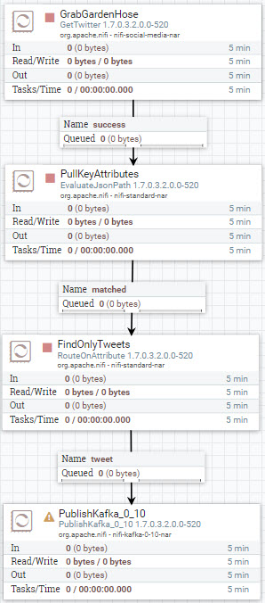

# Thu thập dữ liệu Twitter

## Giới thiệu

Mục tiêu tiếp theo của chúng tôi là thu thập dữ liệu cảm tính từ API **[Decahose streaming](https://developer.twitter.com/en/docs/tweets/sample-realtime/overview/streaming-likes)** của Twitter.

Bạn sẽ xây dựng một luồng NiFi trong một nhóm quy trình nhập dữ liệu từ Twitter bằng cách sử dụng
KEYS và TOKENS mà bạn nhận được từ việc tạo Ứng dụng dành cho nhà phát triển Twitter của mình.
Tiếp theo, bạn sẽ thực hiện việc trích xuất dữ liệu có ý nghĩa sâu sắc từ nội dung JSON
từ nguồn cấp dữ liệu Twitter. Cuối cùng, bạn sẽ lưu trữ dữ liệu vào một chủ đề "tweet" của Kafka.

Bạn sẽ xây dựng luồng NiFi thứ hai trong một nhóm quy trình khác để sử dụng dữ liệu từ
Chủ đề Kafka "tweetsSentiment", có mô hình tình cảm được đào tạo được xây dựng bằng
dịch vụ bên ngoài SparkML và gửi dữ liệu sẽ được lưu trữ vào HBase.

## Điều kiện tiên quyết

- Đã bật Kiến trúc dữ liệu được kết nối
- Thiết lập môi trường phát triển

## Đề cương

- [Phương pháp 1: Xây dựng luồng NiFi để thu thập và lưu trữ](#approach-1-build-a-nifi-flow-for-acquisition-and-storage)
- [Phương pháp 2: Nhập luồng NiFi để thu thập và lưu trữ](#approach-2-import-nifi-flow-for-acquisition-and-storage)
- [Tóm tắt](#tóm tắt)
- [Đọc thêm](#đọc thêm)

## Cách tiếp cận 1: Xây dựng luồng NiFi để thu thập và lưu trữ

Sau khi khởi động hộp cát của bạn, hãy mở HDF **NiFi UI** tại http://sandbox-hdf.hortonworks.com:9090/nifi.

###1\. Tạo nhóm quy trình AcquireTwitterData

Nhóm thu thập này sử dụng **[Dòng Decahose](https://developer.twitter.com/en/docs/tweets/sample-realtime/overview/streaming-likes)** của Twitter thông qua [API phát hiện cảm xúc](https: //developer.twitter.com/en/use-cases/analyze.html), xử lý trước dữ liệu và lưu trữ vào phân tích sau này của Kafka.

Thả biểu tượng nhóm quy trình  vào khung vẽ NiFi.

Chèn Tên nhóm quy trình: `AcquireTwitterData` hoặc một trong những lựa chọn của bạn.

Nhấp đúp chuột vào nhóm quy trình để đi sâu vào nó. Ở cuối khung vẽ, bạn sẽ thấy đường dẫn **NiFi Flow >> AcquireTwitterData**. Hãy bắt đầu kết nối các bộ xử lý để nhập, xử lý trước và lưu trữ dữ liệu.

### Nhập nguồn dữ liệu Twitter

Thả biểu tượng bộ xử lý vào khung vẽ NiFi. Thêm **GetTwitter**.

Giữ **control + nhấp chuột** trên **GetTwitter** để định cấu hình bộ xử lý:

**Bảng 1: Tab Cài đặt**

| Cài đặt | Giá trị |
| :------------- | :------------- |
| Tên | GrabGardenHose |

**Bảng 2: Tab Lập kế hoạch**

| Lập kế hoạch | Giá trị |
| :------------- | :------------- |
| Lịch chạy | `1 giây` |

**Bảng 3: Tab Thuộc tính**

| Bất động sản | Giá trị |
| :----------| :----------|
| **Điểm cuối Twitter** | `Điểm cuối bộ lọc` |
| **Khóa tiêu dùng** | `<Your-Consumer-API-Key>` |
| **Bí mật người tiêu dùng** | `<Your-Consumer-API-Secret-Key>` |
| **Mã thông báo truy cập** | `<Mã thông báo truy cập của bạn>` |
| **Bí mật mã thông báo truy cập** | `<Your-Access-Token-Secret>` |
| Ngôn ngữ | `en` |
| Điều khoản cần lọc | `AAPL,ORCL,GOOG,MSFT,DELL` |

Nhấp vào **ÁP DỤNG**.

### Lấy các thuộc tính chính từ nội dung JSON của FlowFile

Thả biểu tượng bộ xử lý vào khung vẽ NiFi. Thêm **EvaluateJsonPath**.

Tạo kết nối giữa các bộ xử lý **GetTwitter** và **EvaluateJsonPath**. Bay lượn
qua **GetTwitter** để xem biểu tượng mũi tên, nhấn vào bộ xử lý và kết nối nó với
** Đánh giáJsonPath**.

Định cấu hình Tạo kết nối:

| Kết nối | Giá trị |
| :------------- | :------------- |
| Dành cho các mối quan hệ | thành công (** đã chọn**) |

Nhấp vào **THÊM**.

Định cấu hình bộ xử lý **EvaluateJsonPath**:

**Bảng 4: Tab Cài đặt**

| Cài đặt | Giá trị |
| :------------- | :------------- |
| Tên | `PullKeyAttribut` |
| Tự Động Chấm Dứt Mối Quan Hệ | lỗi (** đã kiểm tra**) |
| Tự Động Chấm Dứt Mối Quan Hệ | chưa từng có (**đã chọn**) |

**Bảng 5: Tab Lập kế hoạch**

| Lập kế hoạch | Giá trị |
| :------------- | :------------- |
| Nhiệm vụ đồng thời | `4` |
| Lịch chạy | `1 giây` |

**Bảng 6: Tab Thuộc tính**

Để thêm một thuộc tính mới do người dùng xác định trong trường hợp một trong các thuộc tính sau trong
bảng không được xác định, nhấn nút dấu cộng *******.

| Bất động sản | Giá trị |
| :------------- | :------------- |
| **Điểm đến** | `thuộc tính flowfile` |
| **Loại trả về** | `json` |
| twitter.handle | `$.user.screen_name` |
| twitter.hashtags | `$.entities.hashtags[0].text` |
| twitter.ngôn ngữ | `$.lang` |
| twitter.location | `$.user.location` |
| twitter.msg | `$.văn bản` |
| twitter.time | `$.created_at` |
| twitter.tweet_id | `$.id` |
| twitter.unixtime | `$.timestamp_ms` |
| twitter.user | `$.user.name` |
| twitter.geo | `$.geo` |
| twitter.tọa độ | `$.tọa độ` |
| twitter.place | `$.địa điểm` |

Nhấp vào **ÁP DỤNG**.

### Định tuyến các thuộc tính FlowFiles chứa các Tweet không trống

Thả biểu tượng bộ xử lý vào khung vẽ NiFi. Thêm **RouteOnAttribution**.

Tạo kết nối giữa các bộ xử lý **EvaluateJsonPath** và **RouteOnAttribution**. Bay lượn
qua **EvaluateJsonPath** để xem biểu tượng mũi tên, nhấn vào bộ xử lý và kết nối nó với
**RouteOnAttribution**.

Định cấu hình Tạo kết nối:

| Kết nối | Giá trị |
| :------------- | :------------- |
| Dành cho các mối quan hệ | khớp (**đã chọn**) |

Nhấp vào **THÊM**.

Định cấu hình bộ xử lý **RouteOnAttribution**:

**Bảng 7: Tab Cài đặt**

| Cài đặt | Giá trị |
| :------------- | :------------- |
| Tên | `FindOnlyTweets` |
| Tự Động Chấm Dứt Mối Quan Hệ | chưa từng có (**đã chọn**) |

**Bảng 8: Tab Lập kế hoạch**

| Lập kế hoạch | Giá trị |
| :------------- | :------------- |
| Nhiệm vụ đồng thời | `2` |
| Lịch chạy | `1 giây` |

**Bảng 9: Tab Thuộc tính**

Để thêm một thuộc tính mới do người dùng xác định trong trường hợp một trong các thuộc tính sau trong
bảng không được xác định, nhấn nút dấu cộng *******.

| Bất động sản | Giá trị |
| :------------- | :------------- |
| **Chiến lược định tuyến** | `Đường đến tên tài sản` |
| filterTweetAndLocation | `${twitter.msg:isEmpty():not():and(${twitter.location:isEmpty():not()})}` |

Nhấp vào **ÁP DỤNG**.

### Đưa nội dung FlowFile vào chủ đề Kafka thông qua API KafkaProducer

Thả biểu tượng bộ xử lý vào khung vẽ NiFi. Thêm bộ xử lý **PublishKafka_0_10**.

Tạo kết nối giữa **RouteOnAttribution** và cả hai bộ xử lý **PublishKafka_0_10**. Bay lượn
qua **RouteOnAttribution** để xem biểu tượng mũi tên, nhấn vào bộ xử lý và kết nối nó với
**Xuất bảnKafka_0_10**.

Định cấu hình Tạo kết nối:

| Kết nối | Giá trị |
| :------------- | :------------- |
| Dành cho các mối quan hệ | filterTweetAndLocation (**đã chọn**) |

Nhấp vào **THÊM**.

Định cấu hình bộ xử lý **PublishKafka_0_10** để kết nối mối quan hệ **tweet**:

**Bảng 10: Tab Cài đặt**

| Cài đặt | Giá trị |
| :------------- | :------------- |
| Tự Động Chấm Dứt Mối Quan Hệ | lỗi (** đã kiểm tra**) |
| Tự Động Chấm Dứt Mối Quan Hệ | thành công (** đã chọn**) |

**Bảng 11: Tab Lập kế hoạch**

| Lập kế hoạch | Giá trị |
| :------------- | :------------- |
| Lịch chạy | `1 giây` |

**Bảng 12: Tab Thuộc tính**

| Bất động sản | Giá trị |
| :------------- | :------------- |
| **Nhà môi giới Kafka** | `sandbox-hdp.hortonworks.com:6667` |
| **Tên chủ đề** | `tweet` |

Nhấp vào **ÁP DỤNG**. Dấu hiệu cảnh báo màu vàng trên **PublishKafka_0_10** sẽ chuyển sang
một biểu tượng dừng màu đỏ. Bây giờ bạn đã có luồng NiFi hoàn chỉnh mà không có cảnh báo và sẵn sàng
để thu thập dữ liệu và gửi tới chủ đề Kafka `tweets`.

### Bắt đầu luồng nhóm quy trình để thu thập dữ liệu

Ở phần breadcrumb, chọn cấp độ **NiFi Flow**. Giữ **control + nhấp chuột** trên nhóm quy trình **AcquireTwitterData**, sau đó nhấp vào tùy chọn **bắt đầu**.

Sau khi NiFi ghi dữ liệu twitter của bạn vào Kafka mà bạn có thể kiểm tra bằng cách xem nguồn gốc dữ liệu, bạn có thể tắt nhóm quy trình bằng cách giữ **control + nhấp chuột** trên nhóm quy trình **AcquireTwitterData**, sau đó chọn **stop ** lựa chọn.

### Xác minh dữ liệu được lưu trữ NiFi

Nhập nhóm quy trình **AcquireTwitterData**, nhấn **control + nhấp chuột** trên bộ xử lý PublishKafka_0_10 mà bạn chọn, sau đó nhấn **Xem nguồn gốc dữ liệu**.

Nhấn vào biểu tượng **i** ở hàng bên trái để xem chi tiết về sự kiện xuất xứ. Chọn sự kiện có loại **GỬI**. Trong cửa sổ Sự kiện chứng minh, chọn tab **NỘI DUNG**. Trên **Xác nhận quyền sở hữu đầu ra**, chọn **XEM**.

Bạn sẽ có thể xem dữ liệu NiFi được gửi đến quy trình bên ngoài Kafka. Dữ liệu bên dưới hiển thị tập dữ liệu tweet.

2\. Tạo nhóm quy trình StreamTweetsToHBase

Đảm bảo thoát khỏi nhóm quy trình **AcquireTwitterData** và quay lại cấp độ **NiFi Flow**.

Nhóm thu thập này sử dụng dữ liệu từ Kafka do Spark Structured Streaming đưa vào và truyền nội dung của các tệp luồng tới HBase.

Thả biểu tượng nhóm quy trình  vào canvas NiFi bên cạnh nhóm quy trình **AcquireTwitterData**.

Chèn Tên nhóm quy trình: `StreamTweetsToHBase` hoặc một trong những lựa chọn của bạn.

### Tạo dịch vụ điều khiển mới

Chúng tôi sẽ tạo một dịch vụ bộ điều khiển mới sẽ cần thiết sau này khi chúng tôi định cấu hình bộ xử lý PutHBaseJSON.

Nhấp chuột phải vào nhóm quy trình **StreamTweetsToHBase**, chọn configure. Nhấp vào **Dịch vụ điều khiển**. Nhấp vào nút ***** để tạo dịch vụ điều khiển mới.

Chèn vào trường **Filter**, `HBase_1_1_2_ClientService` rồi nhấn **ADD**.

Chọn biểu tượng **bánh răng** ở phía bên phải. Nhấp vào tab **Thuộc tính**. Định cấu hình các thuộc tính cho dịch vụ bộ điều khiển:

### Đưa nội dung FlowFile vào chủ đề Kafka thông qua API KafkaProducer

Thả biểu tượng bộ xử lý vào khung vẽ NiFi. Thêm bộ xử lý **PublishKafka_0_10**.

Tạo kết nối giữa **RouteOnAttribution** và cả hai bộ xử lý **PublishKafka_0_10**. Bay lượn
qua **RouteOnAttribution** để xem biểu tượng mũi tên, nhấn vào bộ xử lý và kết nối nó với
**Xuất bảnKafka_0_10**.

Định cấu hình Tạo kết nối:

| Kết nối | Giá trị |
| :------------- | :------------- |
| Dành cho các mối quan hệ | filterTweetAndLocation (**đã chọn**) |

Nhấp vào **THÊM**.

Định cấu hình bộ xử lý **PublishKafka_0_10** để kết nối mối quan hệ **tweet**:

**Bảng 10: Tab Cài đặt**

| Cài đặt | Giá trị |
| :------------- | :------------- |
| Tự Động Chấm Dứt Mối Quan Hệ | lỗi (** đã kiểm tra**) |
| Tự Động Chấm Dứt Mối Quan Hệ | thành công (** đã chọn**) |

**Bảng 11: Tab Lập kế hoạch**

| Lập kế hoạch | Giá trị |
| :------------- | :------------- |
| Lịch chạy | `1 giây` |

**Bảng 12: Tab Thuộc tính**

| Bất động sản | Giá trị |
| :------------- | :------------- |
| **Nhà môi giới Kafka** | `sandbox-hdp.hortonworks.com:6667` |
| **Tên chủ đề** | `tweet` |

Nhấp vào **ÁP DỤNG**. Dấu hiệu cảnh báo màu vàng trên **PublishKafka_0_10** sẽ chuyển sang
một biểu tượng dừng màu đỏ. Bây giờ bạn đã có luồng NiFi hoàn chỉnh mà không có cảnh báo và sẵn sàng
để thu thập dữ liệu và gửi tới chủ đề Kafka `tweets`.

### Bắt đầu luồng nhóm quy trình để thu thập dữ liệu

Ở phần breadcrumb, chọn cấp độ **NiFi Flow**. Giữ **control + nhấp chuột** trên nhóm quy trình **AcquireTwitterData**, sau đó nhấp vào tùy chọn **bắt đầu**.

Sau khi NiFi ghi dữ liệu twitter của bạn vào Kafka mà bạn có thể kiểm tra bằng cách xem nguồn gốc dữ liệu, bạn có thể tắt nhóm quy trình bằng cách giữ **control + nhấp chuột** trên nhóm quy trình **AcquireTwitterData**, sau đó chọn **stop ** lựa chọn.

### Xác minh dữ liệu được lưu trữ NiFi

Nhập nhóm quy trình **AcquireTwitterData**, nhấn **control + nhấp chuột** trên bộ xử lý PublishKafka_0_10 mà bạn chọn, sau đó nhấn **Xem nguồn gốc dữ liệu**.

Nhấn vào biểu tượng **i** ở hàng bên trái để xem chi tiết về sự kiện xuất xứ. Chọn sự kiện có loại **GỬI**. Trong cửa sổ Sự kiện chứng minh, chọn tab **NỘI DUNG**. Trên **Xác nhận quyền sở hữu đầu ra**, chọn **XEM**.

Bạn sẽ có thể xem dữ liệu NiFi được gửi đến quy trình bên ngoài Kafka. Dữ liệu bên dưới hiển thị tập dữ liệu tweet.

###2\. Tạo nhóm quy trình StreamTweetsToHBase

Đảm bảo thoát khỏi nhóm quy trình **AcquireTwitterData** và quay lại cấp độ **NiFi Flow**.

Nhóm thu thập này sử dụng dữ liệu từ Kafka do Spark Structured Streaming đưa vào và truyền nội dung của các tệp luồng tới HBase.

Thả biểu tượng nhóm quy trình  vào canvas NiFi bên cạnh nhóm quy trình **AcquireTwitterData**.

Chèn Tên nhóm quy trình: `StreamTweetsToHBase` hoặc một trong những lựa chọn của bạn.

### Tạo dịch vụ điều khiển mới

Chúng tôi sẽ tạo một dịch vụ bộ điều khiển mới sẽ cần thiết sau này khi chúng tôi định cấu hình bộ xử lý PutHBaseJSON.

Nhấp chuột phải vào nhóm quy trình **StreamTweetsToHBase**, chọn configure. Nhấp vào **Dịch vụ điều khiển**. Nhấp vào nút ***** để tạo dịch vụ điều khiển mới.

Chèn vào trường **Filter**, `HBase_1_1_2_ClientService` rồi nhấn **ADD**.

Chọn biểu tượng **bánh răng** ở phía bên phải. Nhấp vào tab **Thuộc tính**. Định cấu hình các thuộc tính cho dịch vụ bộ điều khiển:

### Định tuyến các thuộc tính FlowFiles chứa các Tweet không trống

Thả biểu tượng bộ xử lý vào khung vẽ NiFi. Thêm **RouteOnAttribution**.

Tạo kết nối giữa các bộ xử lý **AttributionToJSON** và **RouteOnAttribution**. Bay lượn
qua **AttributionToJSON** để xem biểu tượng mũi tên, nhấn vào bộ xử lý và kết nối nó với
**RouteOnAttribution**.

Định cấu hình Tạo kết nối:

| Kết nối | Giá trị |
| :------------- | :------------- |
| Dành cho các mối quan hệ | khớp (**đã chọn**) |

Nhấp vào **THÊM**.

Định cấu hình bộ xử lý **RouteOnAttribution**:

**Bảng 19: Tab Cài đặt**

| Cài đặt | Giá trị |
| :------------- | :------------- |
| Tên | `IfTweetsHaveSentimentAndTime` |
| Tự Động Chấm Dứt Mối Quan Hệ | chưa từng có (**đã chọn**) |

**Bảng 20: Tab Lập kế hoạch**

| Lập kế hoạch | Giá trị |
| :------------- | :------------- |
| Nhiệm vụ đồng thời | `2` |
| Lịch chạy | `1 giây` |

**Bảng 21: Tab Thuộc tính**

Để thêm một thuộc tính mới do người dùng xác định trong trường hợp một trong các thuộc tính sau trong
bảng không được xác định, nhấn nút dấu cộng *******.

| Bất động sản | Giá trị |
| :------------- | :------------- |
| **Chiến lược định tuyến** | `Định tuyến đến 'khớp' nếu tất cả đều khớp` |
| filterTweetAndLocation | `${twitter.unixtime:isEmpty():not():and(${twitter.sentiment:isEmpty():not()})}` |

Nhấp vào **ÁP DỤNG**.

### Truyền nội dung của FlowFile sang Bảng dữ liệu HBase

Thả biểu tượng bộ xử lý vào khung vẽ NiFi. Thêm bộ xử lý **PutHBaseJSON**.

Tạo kết nối giữa **RouteOnAttribution** và cả hai bộ xử lý **PutHBaseJSON**. Bay lượn
qua **RouteOnAttribution** để xem biểu tượng mũi tên, nhấn vào bộ xử lý và kết nối nó với
**PutHBaseJSON**.

Định cấu hình Tạo kết nối:

| Kết nối | Giá trị |
| :------------- | :------------- |
| Dành cho các mối quan hệ | khớp (**đã chọn**) |

Nhấp vào **THÊM**.

Định cấu hình bộ xử lý **RouteOnAttribution**:

**Bảng 22: Tab Cài đặt**

| Cài đặt | Giá trị |
| :------------- | :------------- |
| Tự Động Chấm Dứt Mối Quan Hệ | lỗi (** đã kiểm tra**) |
| Tự Động Chấm Dứt Mối Quan Hệ | thành công (** đã chọn**) |

**Bảng 23: Tab Thuộc tính**

| Bất động sản | Giá trị |
| :------------- | :------------- |
| **Dịch vụ khách hàng HBase** | `HBase_1_1_2_ClientService` |
| **Tên bảng** | `tweets_sentiment` |
| Tên trường định danh hàng | `twitter.unixtime` |
| **Gia đình cột** | `social_media_sentiment` |

Nhấp vào **ÁP DỤNG**.

Dấu hiệu cảnh báo màu vàng trên **PutHBaseJSON** sẽ chuyển sang
một biểu tượng dừng màu đỏ. Bây giờ bạn đã có luồng NiFi hoàn chỉnh mà không có cảnh báo và sẵn sàng
để sử dụng dữ liệu từ chủ đề Kafka `tweetsSentiment` và truyền các bản ghi vào Bảng dữ liệu HBase.

Thoát khỏi nhóm quy trình **StreamTweetsToHBase**, sau này chúng ta sẽ cần sử dụng nhóm quy trình này để lấy dữ liệu từ Kafka trên HDF đến từ Spark Structured Streaming trên HDP.

Chúng tôi đã hoàn tất việc xây dựng các luồng NiFi, bạn có thể đi tới phần tóm tắt, sau đó chuyển sang lĩnh vực phát triển tiếp theo cho đường ống dữ liệu này.
## Cách tiếp cận 2: Nhập luồng NiFi để thu thập và lưu trữ

Tải xuống mẫu NiFi [AcquireTweetsStreamTweets.xml](https://raw.githubusercontent.com/hortonworks/data-tutorials/master/tutorials/cda/building-a-sentiment-analysis-application/application/development/nifi-template/ AcquireTweetsStreamTweets.xml) vào máy tính cục bộ của bạn.

Sau khi khởi động hộp cát của bạn, hãy mở HDF **NiFi UI** tại http://sandbox-hdf.hortonworks.com:9090/nifi.

Mở bảng Vận hành nếu chưa mở, sau đó nhấn biểu tượng **Tải lên mẫu** .

Nhấn vào biểu tượng Chọn mẫu .

Trình duyệt tệp trên máy tính cục bộ của bạn sẽ xuất hiện, tìm mẫu **AcquireTweetsStreamTweets.xml** bạn vừa tải xuống, sau đó nhấn **Mở**, sau đó nhấn **TẢI LÊN**.

Bạn sẽ nhận được thông báo rằng **Mẫu đã được nhập thành công.** Nhấn OK để xác nhận.

Thả biểu tượng **Template**  vào khung vẽ NiFi.

Thêm Mẫu có tên **AcquireTweetsStreamTweets**.

Bạn sẽ nhận thấy trên nhóm quy trình có tên **AcquireTwitterData**, có một cảnh báo màu vàng. Nhấp đúp vào nhóm quy trình đó để nhập nó. Phóng to nếu cần. Bộ xử lý **GrabGardenHose** có cảnh báo. Lý do là vì chúng tôi cần cập nhật **Khóa API tiêu dùng và Khóa bí mật API tiêu dùng** và **Mã thông báo truy cập và Bí mật mã thông báo truy cập** trong **bảng thuộc tính** của bộ xử lý để cảnh báo biến mất.

**Bảng 24: Tab Thuộc tính**

| Bất động sản | Giá trị |
| :----------| :----------|
| **Điểm cuối Twitter** | `Điểm cuối bộ lọc` |
| **Khóa tiêu dùng** | `<Your-Consumer-API-Key>` |
| **Bí mật người tiêu dùng** | `<Your-Consumer-API-Secret-Key>` |
| **Mã thông báo truy cập** | `<Mã thông báo truy cập của bạn>` |
| **Bí mật mã thông báo truy cập** | `<Your-Access-Token-Secret>` |
| Ngôn ngữ | `en` |
| Điều khoản cần lọc | `AAPL,ORCL,GOOG,MSFT,DELL` |

Bắt đầu luồng NiFi. Giữ **control + nhấp chuột** trên mỗi nhóm quy trình, sau đó nhấp vào tùy chọn **bắt đầu**.

Sau khi NiFi ghi dữ liệu tweet vào Kafka trên HDP, bạn có thể nhanh chóng kiểm tra các sự kiện xuất xứ bằng cách xem bộ xử lý PublishKafka_0_10 bên trong nhóm quy trình **AcquireTwitterData**.

Để tắt một nhóm quy trình, bạn có thể thực hiện bằng cách giữ **control + nhấp chuột** trên nhóm quy trình **AcquireTwitterData**, sau đó chọn tùy chọn **stop**.

## Bản tóm tắt

Chúc mừng! Bạn đã xây dựng hai luồng dữ liệu trong các nhóm quy trình riêng biệt: **AcquireTwitterData** và **StreamTweetsToHBase**. Hiện đang sử dụng nhóm quy trình **AcquireTwitterData**, chúng tôi có thể thu thập dữ liệu Twitter từ **[Dòng Decahose](https://developer.twitter.com/en/docs/tweets/sample-realtime/overview/streaming-likes của Twitter )** API. Đường dẫn dữ liệu lọc các tweet trước khi xuất bản tin nhắn vào **'tweet'' của chủ đề Kafka**, được dịch vụ bên ngoài Spark chọn. Đường dẫn dữ liệu cũng cập nhật nội dung luồng trong JSON với các cặp giá trị khóa để giúp chúng tôi tính toán điểm tình cảm của từng tweet trong phần sau của bản demo. Luồng dữ liệu khác **StreamTweetsToHBase** nhập tin nhắn Kafka và truyền nội dung đến HBase.

## Đọc thêm

- [Hướng dẫn sử dụng NiFi](https://nifi.apache.org/docs/nifi-docs/html/user-guide.html)