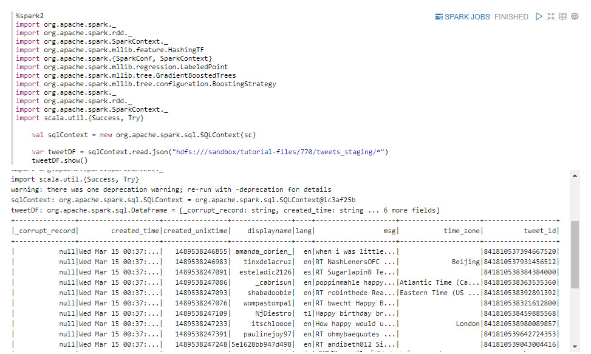
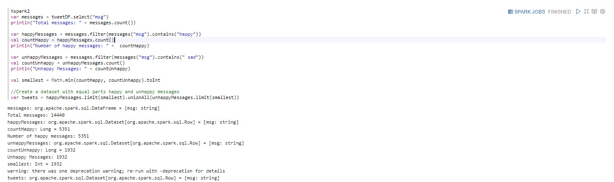
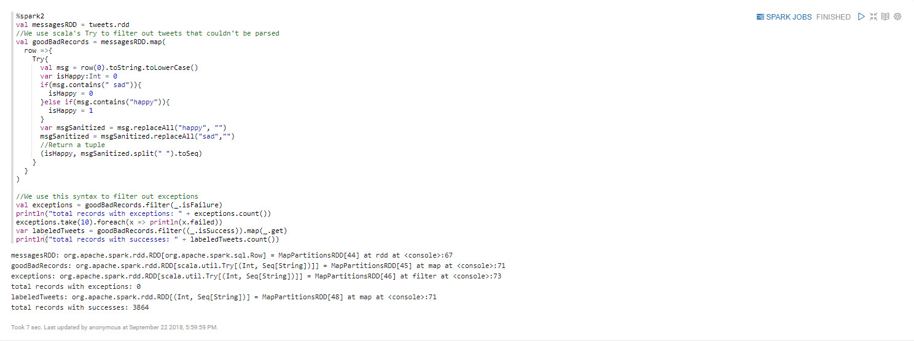
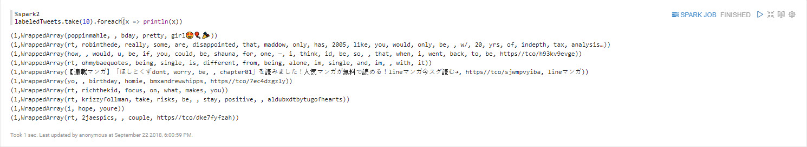
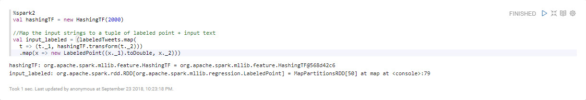
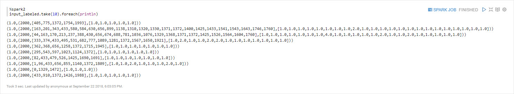
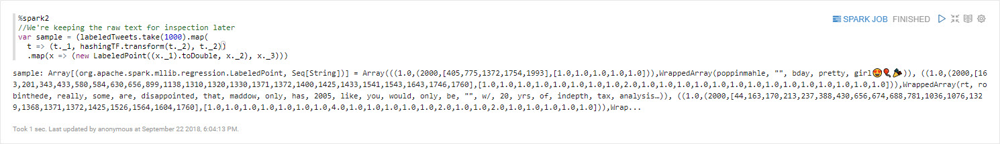

# Làm sạch dữ liệu Twitter thô

## Giới thiệu

Mục tiêu tiếp theo của chúng tôi là **tải dữ liệu tweet** hiện có trong HDFS vào Spark. Chúng tôi sẽ **làm sạch hồ sơ** để tránh sai lệch trong mô hình. Chúng tôi sẽ **gắn nhãn dữ liệu của mình** để sau này, mô hình mà chúng tôi tạo trong giai đoạn phát triển tiếp theo sẽ có thể phân biệt giữa vui và buồn. Chúng tôi sẽ **chuyển đổi dữ liệu** thành một vectơ đặc trưng (mảng đặc trưng) vì mô hình Tăng cường độ dốc yêu cầu định dạng đó cho đầu vào.

## Điều kiện tiên quyết

- Đã bật Kiến trúc dữ liệu được kết nối
- Thiết lập môi trường phát triển
- Dữ liệu Twitter được thu thập

## Đề cương

- [Phương pháp 1: Viết mã Spark để làm sạch dữ liệu Twitter thô](#approach-1-write-spark-code-to-clean-raw-twitter-data)
- [Phương pháp 2: Nhập sổ tay Zeppelin qua giao diện người dùng Zeppelin](#approach-2-import-zeppelin-notebook-via-zeppelin-ui)
- [Tóm tắt](#tóm tắt)
- [Đọc thêm](#đọc thêm)

## Cách tiếp cận 1: Viết Spark Code để làm sạch dữ liệu Twitter thô

Bạn sẽ tạo một Sổ ghi chép Zeppelin sử dụng Scala Spark để làm sạch luồng tweet decahose thô và tinh chỉnh nó để sử dụng trong việc tạo mô hình phân loại tình cảm.

### Tạo sổ tay Zeppelin để làm sạch dữ liệu

Mở giao diện người dùng Zeppelin tại http://sandbox-hdp.hortonworks.com:9995.

1\. Tạo ghi chú mới.

Chèn tên ghi chú là `Cleaning-Raw-Twitter-Data`, sau đó nhấn **Tạo ghi chú**.

Bây giờ sổ ghi chép đã được tạo và chúng ta sẽ bắt đầu viết mã để làm sạch dữ liệu.

### Cấu hình

Trước khi bắt đầu mô hình này, bạn phải đảm bảo **HDFS** và **Spark2** đã được khởi động và trình thông dịch shell được liên kết với sổ ghi chép này.

### Tải dữ liệu vào Spark

Hãy tải các tweet vào Spark SQL và xem chúng. Sao chép và dán mã Scala Spark vào sổ ghi chép Zeppelin:

~~~scala
%spark2
import org.apache.spark._
import org.apache.spark.rdd._
import org.apache.spark.SparkContext._
import org.apache.spark.mllib.feature.HashingTF
import org.apache.spark.{SparkConf, SparkContext}
import org.apache.spark.mllib.regression.LabeledPoint
import org.apache.spark.mllib.tree.GradientBoostedTrees
import org.apache.spark.mllib.tree.configuration.BoostingStrategy
import org.apache.spark._
import org.apache.spark.rdd._
import org.apache.spark.SparkContext._
import scala.util.{Success, Try}

    val sqlContext = new org.apache.spark.sql.SQLContext(sc)

    var tweetDF = sqlContext.read.json("hdfs:///sandbox/tutorial-files/770/tweets_staging/*")
    tweetDF.show()
~~~

> Note: loading the data sometimes takes 5 to 15 minutes.

### Làm sạch hồ sơ

Trong đoạn mã sau, chúng tôi sẽ **làm sạch** dữ liệu để **ngăn chặn sai lệch trong mô hình**.
Chúng tôi muốn xóa bất kỳ tweet nào không chứa “vui” hoặc “buồn”. Chúng tôi cũng đã chọn chọn số lượng tweet vui và buồn bằng nhau để tránh sai lệch trong mô hình. Vì chúng tôi đã tải dữ liệu của mình vào Spark DataFrame nên chúng tôi có thể sử dụng các câu lệnh giống như SQL để chuyển đổi và chọn dữ liệu của mình.

~~~scala
%spark2
var messages = tweetDF.select("msg")
println("Total messages: " + messages.count())

var happyMessages = messages.filter(messages("msg").contains("happy"))
val countHappy = happyMessages.count()
println("Number of happy messages: " +  countHappy)

var unhappyMessages = messages.filter(messages("msg").contains(" sad"))
val countUnhappy = unhappyMessages.count()
println("Unhappy Messages: " + countUnhappy)

val smallest = Math.min(countHappy, countUnhappy).toInt

//Create a dataset with equal parts happy and unhappy messages
var tweets = happyMessages.limit(smallest).unionAll(unhappyMessages.limit(smallest))
~~~

### Dán nhãn dữ liệu

**Trong đoạn mã sau, chúng tôi gắn nhãn dữ liệu và buộc mô hình của chúng tôi tìm hiểu sự khác biệt giữa vui và buồn.** Bây giờ, gắn nhãn mỗi tweet vui là 1 và các tweet không vui là 0. Để ngăn mô hình của chúng tôi gian lận, chúng tôi sẽ xóa những từ vui và buồn khỏi các tweet. Điều này sẽ buộc nó phải suy ra người dùng vui hay buồn khi có sự hiện diện của các từ khác.

Cuối cùng, chúng tôi cũng chia mỗi tweet thành một tập hợp các từ. Để thuận tiện, chúng tôi chuyển đổi Spark Dataframe thành RDD để cho phép bạn dễ dàng chuyển đổi dữ liệu bằng chức năng bản đồ.

Bây giờ chúng ta có một tập hợp các bộ dữ liệu có dạng (Int, Seq[String]), trong đó số 1 cho số hạng đầu tiên biểu thị niềm vui và 0 biểu thị nỗi buồn. Thuật ngữ thứ hai là một chuỗi các từ, bao gồm cả biểu tượng cảm xúc. Chúng tôi đã xóa các từ vui và buồn khỏi danh sách các từ.

~~~scala
%spark2
val messagesRDD = tweets.rdd
//We use scala's Try to filter out tweets that couldn't be parsed
val goodBadRecords = messagesRDD.map(
  row =>{
    Try{
      val msg = row(0).toString.toLowerCase()
      var isHappy:Int = 0
      if(msg.contains(" sad")){
        isHappy = 0
      }else if(msg.contains("happy")){
        isHappy = 1
      }
      var msgSanitized = msg.replaceAll("happy", "")
      msgSanitized = msgSanitized.replaceAll("sad","")
      //Return a tuple
      (isHappy, msgSanitized.split(" ").toSeq)
    }
  }
)

//We use this syntax to filter out exceptions
val exceptions = goodBadRecords.filter(_.isFailure)
println("total records with exceptions: " + exceptions.count())
exceptions.take(10).foreach(x => println(x.failed))
var labeledTweets = goodBadRecords.filter((_.isSuccess)).map(_.get)
println("total records with successes: " + labeledTweets.count())
~~~

Chúng ta hãy nhìn vào sự tiến bộ của quá trình.

~~~scala
%spark2
labeledTweets.take(10).foreach(x => println(x))
~~~

### Chuyển đổi dữ liệu

Tăng cường độ dốc dự kiến ​​khi nhập một vectơ (mảng tính năng) có độ dài cố định, vì vậy chúng tôi cần một cách để chuyển đổi các tweet của mình thành một số vectơ số đại diện cho tweet đó. Một cách tiêu chuẩn để thực hiện việc này là sử dụng [thủ thuật băm](https://en.wikipedia.org/wiki/Feature_hashing), trong đó chúng tôi băm từng từ và lập chỉ mục cho nó thành một mảng có độ dài cố định. Những gì chúng tôi nhận được là một mảng biểu thị số lượng từng từ trong tweet. Cách tiếp cận này được gọi là [mô hình túi từ](https://en.wikipedia.org/wiki/Bag-of-words_model), nghĩa là chúng tôi trình bày mỗi câu hoặc tài liệu dưới dạng một tập hợp các từ riêng biệt và bỏ qua ngữ pháp hoặc thứ tự các từ xuất hiện trong câu. Một cách tiếp cận khác đối với túi từ sẽ là sử dụng thuật toán như Doc2Vec hoặc Lập chỉ mục ngữ nghĩa tiềm ẩn, thuật toán này sẽ sử dụng máy học để xây dựng biểu diễn vectơ của các tweet.

Trong Spark, chúng tôi đang sử dụng HashingTF để băm tính năng. Lưu ý rằng chúng tôi đang sử dụng một mảng có kích thước 2000. Vì kích thước này nhỏ hơn kích thước của từ vựng mà chúng tôi sẽ gặp trên Twitter, điều đó có nghĩa là hai từ có nghĩa khác nhau có thể được băm vào cùng một vị trí trong mảng. Mặc dù có vẻ như đây sẽ là một vấn đề nhưng trên thực tế, điều này lưu giữ đủ thông tin để mô hình vẫn hoạt động. Đây thực sự là một trong những điểm mạnh của tính năng băm, nó cho phép bạn biểu diễn một lượng từ vựng lớn hoặc ngày càng tăng trong một khoảng không gian cố định.

~~~scala
%spark2
val hashingTF = new HashingTF(2000)

//Map the input strings to a tuple of labeled point + input text
val input_labeled = (labeledTweets.map(
  t => (t._1, hashingTF.transform(t._2)))
  .map(x => new LabeledPoint((x._1).toDouble, x._2)))
~~~

Chúng ta hãy xem các vectơ của chúng ta được băm như thế nào.

~~~scala
%spark2
input_labeled.take(10).foreach(println)
~~~

Như bạn có thể thấy, chúng tôi đã chuyển đổi từng tweet thành một vectơ số nguyên. Điều này sẽ rất hiệu quả đối với mô hình học máy, nhưng chúng tôi muốn lưu giữ một số dòng tweet ở dạng chúng tôi có thể đọc được.

~~~scala
%spark2
//We're keeping the raw text for inspection later
var sample = (labeledTweets.take(1000).map(
  t => (t._1, hashingTF.transform(t._2), t._2))
  .map(x => (new LabeledPoint((x._1).toDouble, x._2), x._3)))
~~~

## Cách 2: Nhập Notebook Zeppelin qua Zeppelin UI

Mở HDP **Zeppelin UI** tại http://sandbox-hdp.hortonworks.com:9995.

1\. Nhấp vào **Nhập ghi chú**. Chọn **Thêm từ URL**.

Chèn URL sau vì chúng tôi sẽ nhập sổ ghi chép **Cleaning-Raw-Twitter-Data**:

~~~đánh đập
https://raw.githubusercontent.com/hortonworks/data-tutorials/master/tutorials/cda/building-a-sentiment-analysis-application/application/development/zeppelin-notebook/Cleaning-Raw-Twitter-Data.json
~~~

Nhấp vào **Nhập ghi chú**.

Sổ ghi chép **Dọn dẹp-Raw-Twitter-Data** của bạn bây giờ sẽ là một phần của danh sách sổ ghi chép.

Nhấp vào sổ ghi chép **Dọn dẹp-Raw-Twitter-Data**. Sau đó nhấn nút **phát** để thực hiện tất cả các đoạn văn. Nút **phát** nằm gần tiêu đề của sổ ghi chép này ở đầu trang web.

Bây giờ chúng ta đã hoàn thành việc dọn dẹp dữ liệu Twitter. Chúng ta có thể đi đến phần tóm tắt để xem lại cách chúng tôi làm sạch dữ liệu và chuẩn bị dữ liệu để sẵn sàng hiển thị.

<!--

## Cách 3: Tự động triển khai Zeppelin Notebook thông qua lệnh gọi REST

Mở HDP **sandbox web shell client** tại `sandbox-hdp.hortonworks.com:4200`.

Chúng tôi sẽ sử dụng API cuộc gọi REST của Zeppelin để nhập sổ ghi chép sử dụng SparkSQL hoặc Hive để phân tích Tweet.

~~~bash
NOTEBOOK_NAME="Cleaning-Raw-Twitter-Data"
wget https://github.com/james94/data-tutorials/raw/master/tutorials/cda/building-a-cybersecurity-breach-detection-application/application/development/shell/zeppelin-auto-deploy.sh
bash zeppelin-auto-deploy.sh $NOTEBOOK_NAME
~~~
 -->

## Bản tóm tắt

Chúc mừng! Suy nghĩ về các bước chúng tôi đã thực hiện để tinh chỉnh dữ liệu: **tải dữ liệu** từ HDFS vào Spark, **làm sạch các bản ghi** không chứa vui hay buồn để tránh sai lệch trong mô hình, **được gắn nhãn tweet ** bằng 1 cho vui và 0 cho buồn để dạy mô hình phân biệt giữa vui và buồn và **chuyển đổi dữ liệu** thành một vectơ có độ dài cố định vì Tăng cường độ dốc yêu cầu định dạng đó làm đầu vào. Dữ liệu Twitter đã được xử lý trước và sẵn sàng cho giai đoạn phát triển tiếp theo, đó là xây dựng mô hình học máy.

## Đọc thêm

- [Hướng dẫn về Spark SQL, DataFrames và Datasets](https://spark.apache.org/docs/latest/sql-programming-guide.html)
- [Hướng dẫn lập trình RDD](https://spark.apache.org/docs/latest/rdd-programming-guide.html)
