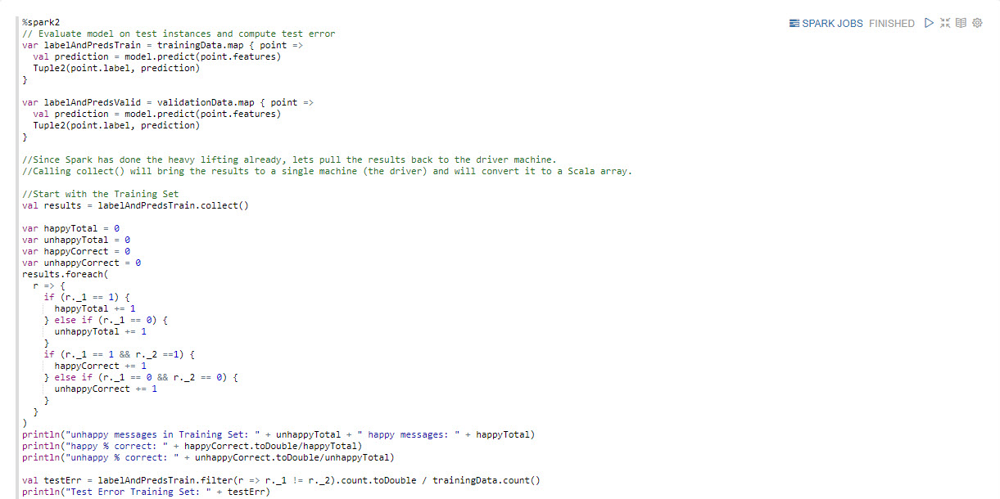

# Xây dựng mô hình phân loại cảm xúc

## Giới thiệu

Mục tiêu tiếp theo của chúng tôi là xây dựng mô hình phân loại tình cảm bằng cách sử dụng tập dữ liệu Twitter đã được làm sạch của chúng tôi. Trước tiên, chúng ta phải huấn luyện mô hình học máy bằng cách tách dữ liệu thành tập huấn luyện và tập xác thực. Tiếp theo chúng ta có thể chọn Tăng cường độ dốc để xây dựng mô hình của mình. Sau đó, chúng tôi sẽ đánh giá mô hình của mình để xem nó hoạt động tốt như thế nào so với tập huấn luyện và tập kiểm tra. Trong quá trình đánh giá, chúng tôi sẽ cố gắng điều chỉnh các tham số của mô hình để xem liệu chúng tôi có thể tăng độ chính xác của mô hình về mức độ phân biệt giữa các dòng tweet vui và buồn hay không. Khi mô hình đã được định cấu hình để có độ chính xác tối đa, chúng tôi sẽ xuất mô hình đó sang HDFS để sử dụng trong sản xuất.

## Điều kiện tiên quyết

- Đã bật Kiến trúc dữ liệu được kết nối
- Thiết lập môi trường phát triển
- Dữ liệu Twitter được thu thập
- **Dữ liệu Twitter thô đã được làm sạch**

## Đề cương

- [Phương pháp 1: Triển khai mô hình phân loại cảm xúc](#approach-1-implement-a-sentiment-classification-model)
- [Phương pháp 2: Nhập sổ tay Zeppelin qua giao diện người dùng Zeppelin](#approach-2-import-zeppelin-notebook-via-zeppelin-ui)
- [Tóm tắt](#tóm tắt)
- [Đọc thêm](#đọc thêm)

## Cách tiếp cận 1: Triển khai Mô hình phân loại cảm xúc

### Tạo sổ tay Zeppelin để xây dựng mô hình

Mở giao diện người dùng Zeppelin tại http://sandbox-hdp.hortonworks.com:9995.

1\. Tạo ghi chú mới.

Chèn tên ghi chú là `Building-Sentiment-Classification-Model`, sau đó nhấn **Tạo ghi chú**.

Bây giờ sổ ghi chép đã được tạo và chúng ta sẽ bắt đầu viết mã để xây dựng mô hình cho dữ liệu.

### Chia thành các tập huấn luyện và xác thực

**Khi đào tạo bất kỳ mô hình học máy nào, bạn muốn tách dữ liệu của mình thành tập huấn luyện và tập xác thực.** Tập huấn luyện là những gì bạn thực sự sử dụng để xây dựng mô hình, trong khi tập xác thực được sử dụng để đánh giá hiệu suất của mô hình sau đó trên dữ liệu mà nó chưa từng gặp trước đây. Điều này cực kỳ quan trọng, bởi vì một mô hình có thể có độ chính xác rất cao khi đánh giá dữ liệu huấn luyện nhưng lại thất bại thảm hại khi gặp dữ liệu mà nó chưa từng thấy trước đó.

Tình trạng này được gọi là **trang bị quá mức**. Một mô hình dự đoán tốt sẽ xây dựng một cách trình bày tổng quát về dữ liệu của bạn theo cách phản ánh những điều thực tế đang diễn ra trong miền vấn đề của bạn và việc khái quát hóa này mang lại cho nó khả năng dự đoán. Thay vào đó, một mô hình phù hợp quá mức sẽ cố gắng dự đoán câu trả lời chính xác cho từng phần dữ liệu đầu vào của bạn và khi làm như vậy, nó sẽ không thể khái quát hóa được. Cách chúng ta biết một mô hình bị quá khớp là khi nó có độ chính xác cao trên tập dữ liệu huấn luyện nhưng kém hoặc không có độ chính xác khi được kiểm tra dựa trên tập xác thực. Đây là lý do tại sao điều quan trọng là luôn kiểm tra mô hình của bạn dựa trên bộ xác thực.

**Sửa lỗi trang bị quá mức:**

Việc trang bị quá mức một chút thường được mong đợi và thường có thể bị bỏ qua. Nếu bạn thấy độ chính xác xác thực của mình rất thấp so với độ chính xác trong quá trình đào tạo, bạn có thể khắc phục tình trạng trang bị quá mức này bằng cách tăng kích thước dữ liệu đào tạo hoặc bằng cách giảm số lượng tham số trong mô hình của mình. Bằng cách giảm số lượng tham số, bạn sẽ giảm khả năng ghi nhớ số lượng lớn mẫu của mô hình. Điều này buộc nó phải xây dựng một mô hình dữ liệu của bạn nói chung, làm cho nó đại diện cho miền vấn đề của bạn thay vì chỉ ghi nhớ dữ liệu đào tạo của bạn.

  Sao chép và dán mã Scala Spark vào sổ ghi chép Zeppelin để phân chia dữ liệu của bạn
  vào tập huấn luyện và tập xác nhận:

~~~scala
// Split the data into training and validation sets (30% held out for validation testing)
val splits = input_labeled.randomSplit(Array(0.7, 0.3))
val (trainingData, validationData) = (splits(0), splits(1))
~~~

### Xây dựng mô hình

Ứng dụng học máy này sử dụng Tăng cường độ dốc để phân loại.
Lý do chúng tôi chọn Tăng cường độ dốc để phân loại so với một số mô hình khác là vì nó dễ sử dụng (không yêu cầu nhiều điều chỉnh tham số) và nó có xu hướng có độ chính xác phân loại cao. Vì lý do này, nó thường được sử dụng trong các cuộc thi học máy.

Các thông số điều chỉnh chúng tôi đang sử dụng ở đây là:
-số lần lặp (truyền dữ liệu)
-Độ sâu tối đa của từng cây quyết định

Trong thực tế khi xây dựng mô hình học máy, bạn thường phải kiểm tra các cài đặt và kết hợp tham số điều chỉnh khác nhau cho đến khi tìm thấy mô hình hoạt động tốt nhất. Vì lý do này, tốt nhất là trước tiên bạn nên huấn luyện mô hình trên một tập hợp con dữ liệu hoặc với một số lần lặp nhỏ. Điều này cho phép bạn nhanh chóng thử nghiệm các kết hợp tham số điều chỉnh khác nhau.

Bước này có thể mất vài phút trên máy ảo sandbox. Nếu bạn đang chạy trên hộp cát và quá trình này mất hơn năm phút, bạn có thể muốn dừng quá trình này và giảm số lần lặp lại.

~~~scala
val boostingStrategy = BoostingStrategy.defaultParams("Classification")
boostingStrategy.setNumIterations(20) //number of passes over our training data
boostingStrategy.treeStrategy.setNumClasses(2) //We have two output classes: happy and sad
boostingStrategy.treeStrategy.setMaxDepth(5)
//Depth of each tree. Higher numbers mean more parameters, which can cause overfitting.
//Lower numbers create a simpler model, which can be more accurate.
//In practice you have to tweak this number to find the best value.

val model = GradientBoostedTrees.train(trainingData, boostingStrategy)
~~~

### Đánh giá mô hình

Hãy đánh giá mô hình để xem nó hoạt động như thế nào so với tập huấn luyện và kiểm tra của chúng tôi.

~~~scala
%spark2
// Evaluate model on test instances and compute test error
var labelAndPredsTrain = trainingData.map { point =>
  val prediction = model.predict(point.features)
  Tuple2(point.label, prediction)
}

var labelAndPredsValid = validationData.map { point =>
  val prediction = model.predict(point.features)
  Tuple2(point.label, prediction)
}

//Since Spark has done the heavy lifting already, lets pull the results back to the driver machine.
//Calling collect() will bring the results to a single machine (the driver) and will convert it to a Scala array.

//Start with the Training Set
val results = labelAndPredsTrain.collect()

var happyTotal = 0
var unhappyTotal = 0
var happyCorrect = 0
var unhappyCorrect = 0
results.foreach(
  r => {
    if (r._1 == 1) {
      happyTotal += 1
    } else if (r._1 == 0) {
      unhappyTotal += 1
    }
    if (r._1 == 1 && r._2 ==1) {
      happyCorrect += 1
    } else if (r._1 == 0 && r._2 == 0) {
      unhappyCorrect += 1
    }
  }
)
println("unhappy messages in Training Set: " + unhappyTotal + " happy messages: " + happyTotal)
println("happy % correct: " + happyCorrect.toDouble/happyTotal)
println("unhappy % correct: " + unhappyCorrect.toDouble/unhappyTotal)

val testErr = labelAndPredsTrain.filter(r => r._1 != r._2).count.toDouble / trainingData.count()
println("Test Error Training Set: " + testErr)

//Compute error for validation Set
val results = labelAndPredsValid.collect()

var happyTotal = 0
var unhappyTotal = 0
var happyCorrect = 0
var unhappyCorrect = 0
results.foreach(
  r => {
    if (r._1 == 1) {
      happyTotal += 1
    } else if (r._1 == 0) {
      unhappyTotal += 1
    }
    if (r._1 == 1 && r._2 ==1) {
      happyCorrect += 1
    } else if (r._1 == 0 && r._2 == 0) {
      unhappyCorrect += 1
    }
  }
)
println("unhappy messages in Validation Set: " + unhappyTotal + " happy messages: " + happyTotal)
println("happy % correct: " + happyCorrect.toDouble/happyTotal)
println("unhappy % correct: " + unhappyCorrect.toDouble/unhappyTotal)

val testErr = labelAndPredsValid.filter(r => r._1 != r._2).count.toDouble / validationData.count()
println("Test Error Validation Set: " + testErr)
~~~

Hãy dành chút thời gian để suy ngẫm về kết quả của chúng tôi tại **trang hướng dẫn (LIÊN KẾT BÊN NGOÀI)**.

Ví dụ lấy từ đầu ra khi mã được thực thi tại thời điểm hình ảnh
ở trên đã được thực hiện:

~~~
unhappy messages in Training Set: 1413 happy messages: 1380
happy % correct: 0.7130434782608696
unhappy % correct: 0.9072894550601557
testErr: Double = 0.1886860007160759
Test Error Training Set: 0.1886860007160759

unhappy messages in Validation Set: 552 happy messages: 519
happy % correct: 0.6454720616570327
unhappy % correct: 0.8641304347826086
testErr: Double = 0.2623716153127918
Test Error Validation Set: 0.2623716153127918
~~~

The results show that the model is very good at detecting unhappy messages (86% accuracy), and significantly less adept at identifying happy messages (64% accuracy). To improve this we could provide the model more examples of happy messages to learn from.

Also note that our training accuracy is slightly higher than our validation accuracy. This is an example of slightly overfitting the training data. Since the training accuracy is only slightly higher than the validation accuracy, this is normal and not something we should concerned about. However, if the validation accuracy was significantly worse than the training accuracy, it would mean the model had grossly overfit its training data. In that situation, you would want to either increase the amount of data available for training or decrease the number of parameters (the complexity) of the model.

### Taking a closer look

Let's take some time to evaluate how our model did by dissecting the data at the individual tweet level.

~~~scala
%spark2
//Print some examples and how they scored
val predictions = sample.map { point =>
  val prediction = model.predict(point._1.features)
  (point._1.label, prediction, point._2)
}

//The first entry is the true label. 1 is happy, 0 is unhappy.
//The second entry is the prediction.
predictions.take(100).foreach(x => println("label: " + x._1 + " prediction: " + x._2 + " text: " + x._3.mkString(" ")))
~~~

Sau khi đào tạo mô hình đầu tiên của mình, bạn nên quay lại và điều chỉnh các tham số của mô hình để xem liệu bạn có thể tăng độ chính xác của mô hình hay không. Trong trường hợp này, hãy thử điều chỉnh độ sâu của từng cây và số lần lặp trên dữ liệu huấn luyện. Bạn cũng có thể để mô hình thấy tỷ lệ tweet vui vẻ cao hơn tweet không vui để xem liệu điều đó có cải thiện độ chính xác dự đoán cho các tweet vui vẻ hay không.

### Xuất mô hình

Sau khi mô hình của bạn chính xác đến mức có thể, bạn có thể xuất mô hình đó để sử dụng trong sản xuất. Các mô hình được đào tạo bằng Spark có thể dễ dàng được tải lại vào Spark Structured
Luồng công việc trực tuyến để sử dụng trong sản xuất.

~~~scala
%spark2
model.save(sc, "hdfs:///sandbox/tutorial-files/770/tweets/RandomForestModel")
~~~

Bây giờ bạn đã biết cách xây dựng mô hình phân tích cảm tính. Các kỹ thuật bạn đã thấy ở đây có thể được áp dụng cho các mô hình phân loại văn bản khác ngoài phân tích cảm tính. Hãy thử phân tích các từ khóa khác ngoài vui và buồn và xem kết quả bạn nhận được nhé.

~~~scala
%spark2
println(model.predict(hashingTF.transform("To this cute little happy sunshine who never fails to bright up my day with his sweet lovely smiles ".split(" ").toSeq)))
~~~

## Cách 2: Nhập Notebook Zeppelin qua Zeppelin UI

Mở HDP **Zeppelin UI** tại http://sandbox-hdp.hortonworks.com:9995.

1\. Nhấp vào **Nhập ghi chú**. Chọn **Thêm từ URL**.

Chèn URL sau vì chúng tôi sẽ nhập sổ ghi chép **Mô hình phân loại-tình cảm-xây dựng**:

~~~đánh đập
https://raw.githubusercontent.com/hortonworks/data-tutorials/master/tutorials/cda/building-a-sentiment-analysis-application/application/development/zeppelin-notebook/Building-Sentiment-Classification-Model.json
~~~

Nhấp vào **Nhập ghi chú**.

Sổ ghi chép **Mô hình phân loại-xây dựng-tình cảm** của bạn bây giờ sẽ là một phần của danh sách sổ ghi chép.

Bấm vào sổ ghi chép **Xây dựng-Tình cảm-Phân loại-Mô hình**. Sau đó nhấn nút **phát** để thực hiện tất cả các đoạn văn. Nút **phát** nằm gần tiêu đề của sổ ghi chép này ở đầu trang web.

Bây giờ chúng ta đã hoàn thành việc dọn dẹp dữ liệu Twitter. Chúng ta có thể đi đến phần tóm tắt để xem lại cách chúng tôi làm sạch dữ liệu và chuẩn bị dữ liệu để sẵn sàng hiển thị.

<!--

## Cách 3: Tự động triển khai Zeppelin Notebook thông qua lệnh gọi REST

Mở HDP **sandbox web shell client** tại `sandbox-hdp.hortonworks.com:4200`.

Chúng tôi sẽ sử dụng API cuộc gọi REST của Zeppelin để nhập sổ ghi chép sử dụng SparkSQL nhằm phân tích nhật ký máy chủ của NASA để phát hiện các vi phạm có thể xảy ra.

~~~bash
NOTEBOOK_NAME="Building-Sentiment-Classification-Model"
wget https://github.com/james94/data-tutorials/raw/master/tutorials/cda/building-a-cybersecurity-breach-detection-application/application/development/shell/zeppelin-auto-deploy.sh
bash zeppelin-auto-deploy.sh $NOTEBOOK_NAME
~~~
-->

## Bản tóm tắt

Chúc mừng! Bạn đã học cách xây dựng mô hình phân loại cảm tính bằng cách sử dụng Tăng cường độ dốc của SparkML. Các kỹ thuật bạn thấy ở đây có thể được áp dụng trực tiếp cho các mô hình phân loại văn bản khác, chẳng hạn như phân loại thư rác. Sau này, hãy thử chạy mã này với các từ khóa khác ngoài vui và buồn và xem bạn có thể xây dựng mô hình nào.

Xem lại quy trình chúng tôi thực hiện để xây dựng mô hình: tách dữ liệu thành tập huấn luyện và tập xác thực, đánh giá độ chính xác của mô hình, định cấu hình mô hình để có độ chính xác tối đa và xuất mô hình sang HDFS để sử dụng sau này với Spark Streaming.

## Đọc thêm

- [Hướng dẫn về Thư viện máy học Spark (MLlib)](https://spark.apache.org/docs/latest/ml-guide.html)