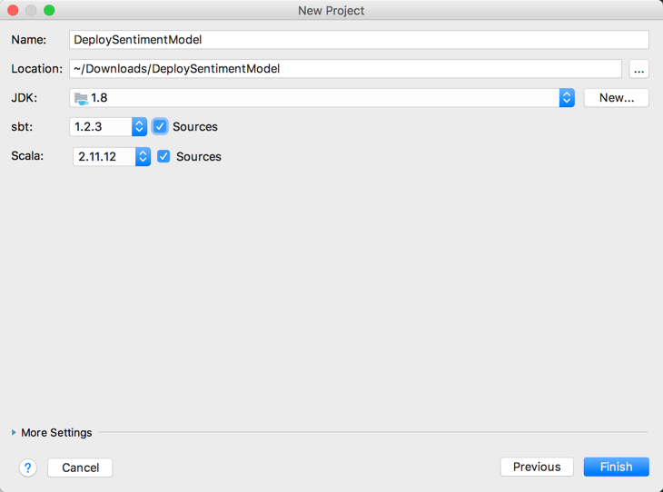
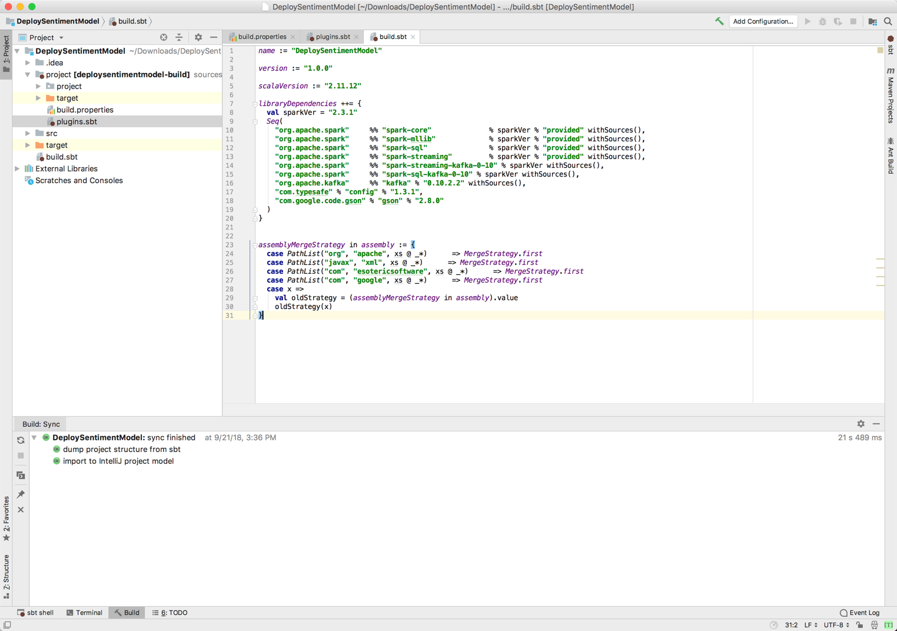
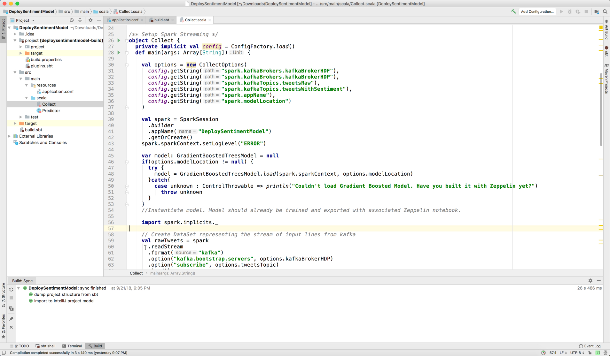
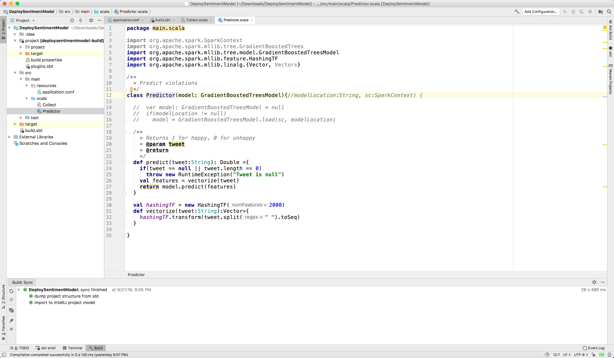
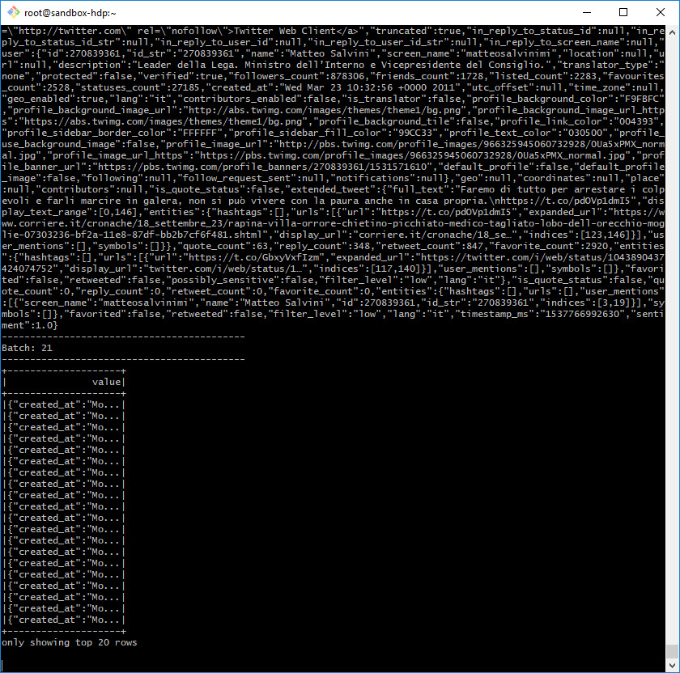

#Triển khai mô hình phân loại cảm xúc

## Giới thiệu

Mục tiêu tiếp theo của chúng tôi với tư cách là Kỹ sư dữ liệu là triển khai ứng dụng Truyền phát có cấu trúc Spark trong Scala để lấy mô hình cảm tính từ HDFS chạy trên HDP, sau đó lấy dữ liệu tweet mới từ chủ đề "tweet" của Apache Kafka chạy trên HDP, thực hiện một số xử lý bằng cách thêm điểm tình cảm vào mỗi tweet dựa trên đầu ra của mô hình đã được đào tạo và truyền phát từng tweet với trường điểm tình cảm mới cho chủ đề "tweetsSentiment" của Apache Kafka chạy trên HDF.

## Điều kiện tiên quyết

- Đã bật Kiến trúc dữ liệu được kết nối
- Thiết lập môi trường phát triển
- Dữ liệu Twitter được thu thập
- Đã làm sạch dữ liệu Twitter thô
- Xây dựng mô hình phân loại cảm xúc
- Xem qua **[Thiết lập môi trường phát triển Spark với Scala](https://hortonworks.com/tutorial/setting-up-a-spark-development-environment-with-scala/)**, nó sẽ bao gồm * *cài đặt SBT**, **IntelliJ** với Plugin Scala và một số khái niệm cơ bản sẽ được xây dựng trong hướng dẫn này

## Đề cương

- [Triển khai ứng dụng Spark Streaming để triển khai mô hình](#approach-1-implement-a-spark-streaming-app-to-deploy-the-model)
- [Tóm tắt](#tóm tắt)
- [Đọc thêm](#đọc thêm)

## Cách 1: Triển khai Spark Streaming App để triển khai Model

### Tạo dự án IntelliJ mới

**Tạo dự án mới**

Chọn **Scala** với **sbt**, sau đó nhấn tiếp theo.

Đặt tên cho dự án của bạn là `DeploySentimentModel`

Vui lòng sử dụng vị trí mặc định của InteliJ để lưu trữ ứng dụng. cái một
trong hình sau đây là một vị trí tùy chỉnh để lưu trữ ứng dụng.

Chọn **sbt phiên bản 1.2.3** và **Scala phiên bản 2.11.12** thích hợp. Đảm bảo các nguồn được kiểm tra để tải xuống các nguồn.

Nhấp vào **hoàn tất** để tiếp tục. Mở thư mục **Dự án**.

### Thư mục dự án

Từ **project**, chúng tôi sẽ xác minh **build.properties** có chứa phiên bản **sbt** thích hợp. Tiếp theo, chúng ta sẽ tạo một thư mục plugin.sbt để **sbt** tải xuống các plugin cần thiết để nhập thư viện bên ngoài.

### build.properties

Xác minh tệp **build.properties** có chứa **phiên bản SBT** thích hợp.
Nó phải phù hợp với phiên bản bạn đã chọn khi tạo dự án IntelliJ.

~~~scala
sbt.version = 1.2.3
~~~

Bằng cách thêm **phiên bản SBT**, điều này cho phép những người có các phiên bản khác nhau của trình khởi chạy SBT xây dựng cùng một dự án với kết quả nhất quán.

### plugin.sbt

**Plugin là gì?**

- Một plugin bổ sung thêm cài đặt mới, phần mở rộng cho định nghĩa bản dựng. Trong trường hợp của chúng ta,
chúng ta cần thêm các plugin **sbt-assembly** và **sbt-depedency-graph**.

Nhấp chuột phải vào thư mục **project**, chọn **new**, sau đó chọn **file**.
Đặt tên tệp là `plugins.sbt`, sau đó nhấp vào **ok**.

Thêm các dòng sau vào tập tin:

~~~scala
logLevel := Level.Warn
addSbtPlugin("com.eed3si9n" % "sbt-assembly" % "0.14.7")
addSbtPlugin("net.virtual-void" % "sbt-dependency-graph" % "0.9.2")
~~~

Nếu bạn chưa bật tính năng tự động nhập cho các dự án sbt, bạn nên **Bật tự động nhập**. Bất cứ khi nào chúng tôi thêm nhiều plugin hơn vào tệp này, IntelliJ sẽ cho phép sbt tự động nhập chúng.

Các từ khóa trong tệp cấu hình cho SBT có ý nghĩa gì?

- **logLevel**: kiểm soát mức độ ghi nhật ký cho dự án của chúng tôi, hiện tại chúng tôi đã bật tính năng ghi nhật ký gỡ lỗi cho tất cả các tác vụ trong dự án hiện tại
- **addSbtPlugin**: cho phép bạn khai báo phần phụ thuộc của plugin, lấy đầu vào là định dạng sau ("`IvyModuleID`" % "`ArtifactID`" % "`Revision`")
- **sbt-assembly**: plugin này tạo một JAR chất lượng cho dự án của bạn với tất cả các phần phụ thuộc của nó
- **sbt-dependency-graph**: plugin này trực quan hóa các phần phụ thuộc của dự án của bạn

**Tham khảo plugin.sbt:**

- để biết thêm thông tin về **logLevel**, hãy tham khảo [Định cấu hình và sử dụng tính năng ghi nhật ký](https://www.scala-sbt.org/1.x/docs/Howto-Logging.html)
- để biết thêm thông tin về sự phụ thuộc của plugin **sbt-assembly**, chẳng hạn như bản sửa đổi được sử dụng, hãy tham khảo [sbt-assembly repo - Sử dụng Plugin đã xuất bản](https://github.com/sbt/sbt-assembly)
- để biết thêm thông tin về phần phụ thuộc plugin **sbt-dependency-graph**, chẳng hạn như bản sửa đổi được sử dụng, hãy tham khảo [sbt-dependency-graph repo](https://github.com/jrudolph/sbt-dependency-graph)
- 
### SBT

Chúng tôi sẽ sử dụng SBT để nhập **Thư viện Spark**, **Thư viện Kafka**, **Thư viện Google gson**, **thư viện cấu hình tyesafe** và **tài liệu thích hợp** vào IntelliJ. Do đó, IntelliJ có thể nhận ra mã Spark và GSON. Sao chép và dán các dòng sau vào tệp **build.sbt** để ghi đè lên nó:

~~~scala
name := "DeploySentimentModel"

version := "2.0.0"

scalaVersion := "2.11.12"

libraryDependencies ++= {
  val sparkVer = "2.3.1"
  Seq(
    "org.apache.spark"     %% "spark-core"              % sparkVer % "provided" withSources(),
    "org.apache.spark"     %% "spark-mllib"             % sparkVer % "provided" withSources(),
    "org.apache.spark"     %% "spark-sql"               % sparkVer % "provided" withSources(),
    "org.apache.spark"     %% "spark-streaming"         % sparkVer % "provided" withSources(),
    "org.apache.spark"     %% "spark-streaming-kafka-0-10" % sparkVer withSources(),
    "org.apache.spark"     %% "spark-sql-kafka-0-10" % sparkVer withSources(),
    "org.apache.kafka"     %% "kafka" % "0.10.2.2" withSources(),
    "org.jpmml"            % "pmml-model" % "1.4.6",
    "com.typesafe" % "config" % "1.3.3",
    "com.google.code.gson" % "gson" % "2.8.5"
  )
}

assemblyMergeStrategy in assembly := {
  case PathList("org", "apache", xs @ _*)      => MergeStrategy.first
  case PathList("javax", "xml", xs @ _*)      => MergeStrategy.first
  case PathList("com", "esotericsoftware", xs @ _*)      => MergeStrategy.first
  case PathList("com", "google", xs @ _*)      => MergeStrategy.first
  case x =>
    val oldStrategy = (assemblyMergeStrategy in assembly).value
    oldStrategy(x)
}
~~~

Các từ khóa trong tệp cấu hình cho SBT có ý nghĩa gì?

- **name**: chỉ định tên dự án
- **version**: chỉ định phiên bản dự án
- **scalaVersion**: chỉ định phiên bản Scala
- **libraryDependency**: chỉ định rằng chúng tôi muốn SBT nhập `Thư viện Spark` **spark-core, spark-mllib, spark-sql, spark-streaming, spark-streaming-kafka-0-10, spark- sql-kafka-0-10** với `sparkVer` **2.3.1** được liên kết, nhập `Thư viện Kafka` **kafka** sau đây với phiên bản được liên kết **0.10.0**, nhập `typesafe sau thư viện` **config** với phiên bản được liên kết **1.3.1** và nhập `thư viện Google gson` **gson** với phiên bản được liên kết **2.8.0**
- **ID nhóm**: Ví dụ: org.apache.spark
- **ID giả tạo**: Ví dụ: spark-core
- **Bản sửa đổi**: sparkVer = 2.3.1, nhưng bạn cũng có thể viết rõ ràng số phiên bản
- **%%**: Ví dụ: nối **phiên bản scala** vào **ArtifactID**
- **Seq(...)**: dùng kết hợp với **++=** để tải nhiều thư viện phụ thuộc trong SBT
- **assemblyMergeStrategy**: ánh xạ `tên đường dẫn` thành `chiến lược hợp nhất`, mỗi mẫu trường hợp sử dụng PathList(...) được ánh xạ tới MergeStrategy.first, cho biết hãy chọn tệp đầu tiên phù hợp theo thứ tự đường dẫn lớp. Ví dụ: mẫu trường hợp đầu tiên sử dụng `PathList(...)` để chọn `org/apache/*` từ jar đầu tiên.

**Tham khảo SBT:**

- **libraryDependcies** được tích hợp sẵn sbt, để biết thêm thông tin, hãy xem [libraryDependcies - sbt doc](https://www.scala-sbt.org/1.x/docs/Library-Dependency.html)
- **assemblyMergeStrategy** là một plugin sbt, để biết thêm thông tin, hãy xem [sbt-assembly repo](https://github.com/sbt/sbt-assembly)
- [Hướng dẫn tích hợp Spark Streaming + Kafka 0.10.0](https://spark.apache.org/docs/latest/streaming-kafka-0-10-integration.html)
- Nếu bạn gặp phải tình trạng phụ thuộc chưa được giải quyết đối với một mô-đun không được chỉ ra bởi Nhật ký bản dựng, thì bạn nên tham khảo liên kết **[mvnrepository](http://mvnrepository.com)** và kiểm tra từng thư việnPhụ thuộc để đảm bảo dòng định nghĩa bản dựng đúng

Bây giờ chúng tôi đã thêm các phần phụ thuộc của ứng dụng Spark Structured Streaming, chúng tôi đã sẵn sàng bắt đầu viết mã.

### Tạo ứng dụng phát trực tuyến có cấu trúc Spark

### thư mục tài nguyên

Trong dự án của bạn, nếu thư mục hoặc thư mục **resources** chưa tồn tại, hãy tạo một thư mục trong **src/main** có tên là `resources` và tạo tệp `application.conf` ở đó.

### ứng dụng.conf

**application.conf** chứa các cấu hình về môi trường mà chúng ta sẽ chạy ứng dụng trong đó. Chúng tôi sẽ sử dụng tệp cấu hình sau và tải cấu hình vào **Scala**.

~~~scala
spark {

  kafkaBrokers {
    kafkaBrokerHDF: "sandbox-hdf.hortonworks.com:6667"
    kafkaBrokerHDP: "sandbox-hdp.hortonworks.com:6667"
  }

  appName = "DeploySentimentModel"
  messageFrequency = 200 //milliseconds
  modelLocation = "hdfs:///sandbox/tutorial-files/770/tweets/RandomForestModel"

  kafkaTopics {
    tweetsRaw: "tweets"
    tweetsWithSentiment: "tweetsSentiment"
  }
}
~~~

Những cấu hình nào chúng ta đang chuyển tới Scala bằng tệp này?

- **kafkaBrokers**: chỉ định vị trí máy chủ mà mỗi Nhà môi giới Kafka tại HDF và HDP được sử dụng trong ứng dụng sẽ lắng nghe các gói đến ứng dụng.
- **appName**: chỉ định tên ứng dụng
- **messageFrequency**: tần suất gửi tin nhắn
- **modelLocation**: vị trí đặt mô hình học máy của chúng tôi
- **kafkaTopics**: Các chủ đề Kafka sẽ được sử dụng trong ứng dụng **Spark Structured Streaming**

**Tham khảo application.conf:**

- Để biết thêm thông tin về tệp cấu hình Scala, hãy tham khảo [Tải cấu hình trong Scala](https://danielasfregola.com/2015/06/01/loading-configurations-in-scala/)

### Collect.scala

Bây giờ chúng ta đã có tệp **application.conf**, chúng ta sẽ tham chiếu nó trong tệp mã **Collect.scala** mà chúng ta sẽ triển khai. Tạo một **tệp mới** tên là `Collect.scala` trong thư mục **src/main/scala**. Sao chép và dán đoạn mã sau vào tệp:

~~~scala
package main.scala

import java.util.Properties

import scala.util.control.ControlThrowable
import com.google.gson.{Gson, JsonParser}
import com.typesafe.config.ConfigFactory
import org.apache.kafka.clients.producer.{KafkaProducer, ProducerRecord}
import org.apache.spark.mllib.classification.LogisticRegressionModel
import org.apache.spark.mllib.tree.model.GradientBoostedTreesModel
import org.apache.spark.sql.{ForeachWriter, SparkSession}
import org.dmg.pmml.True

import scala.util.Try

case class CollectOptions(
                           kafkaBrokerHDF: String,
                           kafkaBrokerHDP: String,
                           tweetsTopic: String,
                           tweetsWithSentimentTopic: String,
                           appName:String,
                           modelLocation:String
                         )

/** Setup Spark Streaming */
object Collect {
  private implicit val config = ConfigFactory.load()
  def main(args: Array[String]) {

    val options = new CollectOptions(
      config.getString("spark.kafkaBrokers.kafkaBrokerHDF"),
      config.getString("spark.kafkaBrokers.kafkaBrokerHDP"),
      config.getString("spark.kafkaTopics.tweetsRaw"),
      config.getString("spark.kafkaTopics.tweetsWithSentiment"),
      config.getString("spark.appName"),
      config.getString("spark.modelLocation")
    )

    val spark = SparkSession
      .builder
      .appName("DeploySentimentModel")
      .getOrCreate()
    spark.sparkContext.setLogLevel("ERROR")

    var model: GradientBoostedTreesModel = null
    if(options.modelLocation != null) {
      try {
        model = GradientBoostedTreesModel.load(spark.sparkContext, options.modelLocation)
      }catch{
        case unknown : ControlThrowable => println("Couldn't load Gradient Boosted Model. Have you built it with Zeppelin yet?")
          throw unknown
      }
    }
    //Instantiate model. Model should already be trained and exported with associated Zeppelin notebook.

    import spark.implicits._

    // Create DataSet representing the stream of input lines from kafka
    val rawTweets = spark
      .readStream
      .format("kafka")
      .option("kafka.bootstrap.servers", options.kafkaBrokerHDP)
      .option("subscribe", options.tweetsTopic)
      .load()
      .selectExpr("CAST(value AS STRING)")
      .as[String]

    rawTweets.printSchema()
    //Our Predictor class can't be serialized, so we're using mapPartition to create
    // a new model instance for each partition.
    val tweetsWithSentiment = rawTweets.mapPartitions((iter) => {
      val pred = new Predictor(model)//options.modelLocation, context)
      val parser = new JsonParser()
      iter.map(
        tweet =>
          //For error handling, we're mapping to a Scala Try and filtering out records with errors.
          Try {
            val element = parser.parse(tweet).getAsJsonObject
            val msg = element.get("text").getAsString
            val sentiment = pred.predict(msg)
            element.addProperty("sentiment", pred.predict(tweet))
            val json = element.toString
            println(json)
            json
          }
      ).filter(_.isSuccess).map(_.get)
    })

    val query = tweetsWithSentiment.writeStream
      .outputMode("append")
      .format("console")
      .start()

    //Push back to Kafka
    val kafkaProps = new Properties()
    //props.put("metadata.broker.list",  options.kafkaBrokerList)
    kafkaProps.put("bootstrap.servers", options.kafkaBrokerHDF)
    kafkaProps.put("key.serializer", "org.apache.kafka.common.serialization.StringSerializer")
    kafkaProps.put("value.serializer", "org.apache.kafka.common.serialization.StringSerializer")

    tweetsWithSentiment
      .writeStream
      .foreach(
        new ForeachWriter[(String)] {

          //KafkaProducer can't be serialized, so we're creating it locally for each partition.
          var producer:KafkaProducer[String, String] = null

          override def process(value: (String)) = {
            val message = new ProducerRecord[String, String](options.tweetsWithSentimentTopic, null,value)
            println("sending windowed message: " + value)
            producer.send(message)
          }

          override def close(errorOrNull: Throwable) = ()

          override def open(partitionId: Long, version: Long) = {
            producer = new KafkaProducer[String, String](kafkaProps)
            true
          }
        }).start()

    query.awaitTermination()
  }
}
~~~

### Dự đoán.scala

Vì chúng tôi đang tham chiếu lớp Dự đoán trong tệp nguồn **Collect.scala** để dự đoán xem tweet vui hay buồn và nó chưa được triển khai nên chúng tôi sẽ phát triển tệp nguồn **Predictor.scala**. Tạo một tệp Lớp Scala mới có tên `Predictor` trong thư mục **src/main/scala** và đối với **kind**, chọn **Class**. Sao chép và dán đoạn mã sau vào tập tin

~~~scala
package main.scala

import org.apache.spark.SparkContext
import org.apache.spark.mllib.tree.GradientBoostedTrees
import org.apache.spark.mllib.tree.model.GradientBoostedTreesModel
import org.apache.spark.mllib.feature.HashingTF
import org.apache.spark.mllib.linalg.{Vector, Vectors}

/**
  * Predict violations
  */
class Predictor(model: GradientBoostedTreesModel){//modelLocation:String, sc:SparkContext) {

  //  var model: GradientBoostedTreesModel = null
  //  if(modelLocation != null)
  //    model = GradientBoostedTreesModel.load(sc, modelLocation)

  /**
    * Returns 1 for happy, 0 for unhappy
    * @param tweet
    * @return
    */
  def predict(tweet:String): Double ={
    if(tweet == null || tweet.length == 0)
      throw new RuntimeException("Tweet is null")
    val features = vectorize(tweet)
    return model.predict(features)
  }

  val hashingTF = new HashingTF(2000)
  def vectorize(tweet:String):Vector={
    hashingTF.transform(tweet.split(" ").toSeq)
  }

}
~~~

### Tổng quan về Spark Code để triển khai Model

Để gửi mã tới Spark, chúng tôi cần biên dịch mã và gửi mã cho Spark. Vì mã của chúng tôi phụ thuộc vào các thư viện khác (như GSON) để chạy, nên chúng tôi phải đóng gói mã của mình với các phần phụ thuộc này vào một tập hợp có thể gửi tới Spark. Để thực hiện việc này, chúng tôi đang sử dụng trình quản lý phụ thuộc có tên là SBT. Bạn sẽ cần cài đặt trình quản lý này trên máy của mình. Nếu chưa cài đặt, hãy tham khảo các điều kiện tiên quyết. (Bạn sẽ nhận thấy rằng chúng tôi cũng đã thêm dòng mã này vào tệp plugin.sbt. Đây cũng là điều bắt buộc.) Sau khi cài đặt xong, bạn có thể đóng gói mã và các phần phụ thuộc của mình vào một tệp jar duy nhất. Mở thiết bị đầu cuối mac/linux hoặc windows git bash trên máy chủ của bạn chứ không phải máy ảo, sau đó chạy mã shell sau:

~~~bash
cd ~/IdeaProjects/DeploySentimentModel
sbt clean
sbt assembly
~~~

Điều này sẽ tạo một tệp jar duy nhất bên trong thư mục đích. Bạn có thể sao chép jar này vào hộp cát HDP như thế này:

~~~scala
scp -P 2222 ./target/scala-2.11/DeploySentimentModel-assembly-1.0.0.jar root@sandbox-hdp.hortonworks.com:/root
~~~

Khi điều này đã được sao chép vào hộp cát HDP, bạn muốn đảm bảo **Kafka** được bật cho cả hộp cát HDP và HDF, **Spark2 và HBase** được bật cho hộp cát HDP và **NiFi** được bật đã bật cho hộp cát HDF. Đảm bảo luồng NiFi được bật và các dòng tweet đang chuyển đến Kafka thông qua Spark Structured Streaming.

Mở trình bao web hộp cát HDP của bạn tại http://sandbox-hdp.hortonworks.com:4200. Thông tin đăng nhập là `root` và mật khẩu bạn đặt. Sau đó sử dụng spark-submit để triển khai jar lên Spark:

~~~scala
/usr/hdp/current/spark2-client/bin/spark-submit --class "main.scala.Collect" --master local[4] ./DeploySentimentModel-assembly-1.0.0.jar
~~~

Ở đây, chúng tôi chỉ triển khai jar trên một máy bằng cách sử dụng --master local[4]. Trong quá trình sản xuất, bạn muốn thay đổi các cài đặt này để chạy trên Yarn. Sau khi gửi công việc, bạn sẽ thấy đầu ra trên thiết bị đầu cuối khi Spark ghi điểm cho mỗi tweet.

Đầu ra shell (chạy trên windows 10 git bash tương tự cho thiết bị đầu cuối mac/linux)
minh họa rằng Ứng dụng truyền phát có cấu trúc Spark đang lấy dữ liệu từ
Chủ đề HDP Kafka "tweet" và phát trực tuyến các tweet có điểm tình cảm tới HDF
Chủ đề Kafka "tweetSentiment".

## Bản tóm tắt

Chúc mừng! Bạn đã triển khai ứng dụng Truyền phát có cấu trúc Spark để lấy các thông báo JSON từ "tweets" chủ đề Kafka, thêm trường tình cảm vào JSON dựa trên mô hình tình cảm được tải từ HDFS và gửi dữ liệu được bổ sung phong phú trở lại chủ đề Kafka "tweetsSentiment".

## Đọc thêm

- [Xây dựng dự án Scala với IntelliJ và SBT](https://docs.scala-lang.org/getting-started-intellij-track/building-a-scala-project-with-intellij-and-sbt.html)
- [Truyền phát có cấu trúc Apache Spark](https://spark.apache.org/docs/latest/structured-streaming-programming-guide.html)
- [Tích hợp Apache Spark 2.3.1 + Kafka](https://spark.apache.org/docs/2.3.1/structured-streaming-kafka-integration.html)
- [Thư viện Google GSON](https://github.com/google/gson)
- [API Java JPMML](https://github.com/jpmml)
- [Hội SBT](https://github.com/sbt/sbt-assembly)