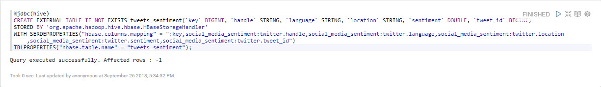
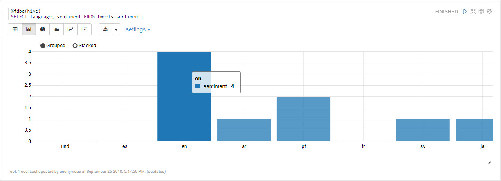

# Trực quan hóa điểm số tình cảm

## Giới thiệu

Bạn sẽ sử dụng Trình thông dịch Hive JDBC của Zeppelin để thực hiện các truy vấn SQL dựa vào bảng "tweets_sentiment" của noSQL HBase để tính tổng các dòng tweet vui và buồn cũng như thực hiện trực quan hóa kết quả.

## Điều kiện tiên quyết

- Đã bật Kiến trúc dữ liệu được kết nối
- Thiết lập môi trường phát triển
- Dữ liệu Twitter được thu thập
- Đã làm sạch dữ liệu Twitter thô
- Xây dựng mô hình phân loại cảm xúc
- Triển khai mô hình phân loại cảm xúc

## Đề cương

- [Triển khai sổ ghi chép Zeppelin để trực quan hóa điểm tình cảm](#implement-a-zeppelin-notebook-to-visualize-sentiment-scores)
- [Tóm tắt](#tóm tắt)
- [Đọc thêm](#đọc thêm)

## Triển khai Sổ ghi chép Zeppelin để trực quan hóa Điểm số tình cảm

### Tạo ánh xạ bảng Hive tới bảng HBase

Để trực quan hóa dữ liệu được lưu trữ trong HBase, bạn có thể sử dụng Trình thông dịch JDBC Hive của zeppelin:

~~~sql
%jdbc(hive)
CREATE EXTERNAL TABLE IF NOT EXISTS tweets_sentiment(`key` BIGINT, `handle` STRING, `language` STRING, `location` STRING, `sentiment` DOUBLE, `tweet_id` BIGINT)
STORED BY 'org.apache.hadoop.hive.hbase.HBaseStorageHandler'
WITH SERDEPROPERTIES("hbase.columns.mapping" = ":key,social_media_sentiment:twitter.handle,social_media_sentiment:twitter.language,social_media_sentiment:twitter.location,social_media_sentiment:twitter.sentiment,social_media_sentiment:twitter.tweet_id")
TBLPROPERTIES("hbase.table.name" = "tweets_sentiment");
~~~

### Tải mẫu dữ liệu

Tải dữ liệu từ bảng Hive:

~~~sql
%jdbc(hive)
SELECT * FROM tweets_sentiment;
~~~

### Trực quan hóa Điểm cảm tính cho mỗi ngôn ngữ trong biểu đồ thanh

Để xem điểm cảm tính của từng tweet theo ngôn ngữ, hãy sao chép và dán truy vấn sau.

~~~sql
%jdbc(hive)
SELECT language, sentiment FROM tweets_sentiment;
~~~

## Bản tóm tắt

Chúc mừng! Bạn vừa học cách viết mã Hive để truy cập bảng HBase, truy vấn bảng và trực quan hóa dữ liệu bằng Trình thông dịch Hive JDBC của Zeppelin.

## Đọc thêm

- [Hive HBaseIntegration](https://cwiki.apache.org/confluence/display/Hive/HBaseIntegration)
